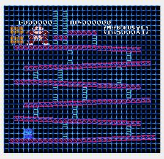
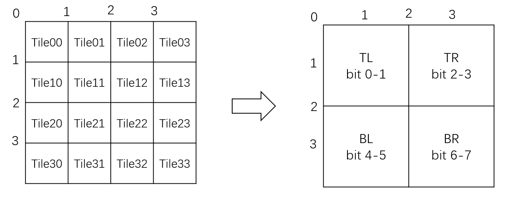
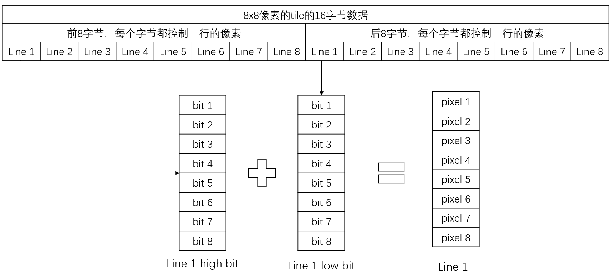

# 1.程序架构设计

## 1.1 RetroArch 架构

[RetroArch](https://www.retroarch.com/) 是一个多平台模拟器框架，它的设计理念非常值得参考：

|             模块             |                   职责                    |
| :--------------------------: | :---------------------------------------: |
|   **RetroArch (Frontend)**   | 负责 UI、音视频、输入、状态保存、配置管理 |
|   **Libretro Core (Core)**   | 仅负责游戏机逻辑模拟，如 NES、SNES、GB 等 |
| **Libretro API (Interface)** |  定义标准接口，使核心可以被任何前端加载   |

在本系列教程中，整个模拟器的结构将会采取RetroArch的思路来进行设计。

 分为三个主要部分：

```
前端（Frontend）
└── 调用核心，负责音视频输出、输入事件、UI交互

核心（Core）
└── 模拟 CPU、PPU、APU、内存、总线等 NES 硬件逻辑

通用接口（Bridge）
└── 定义前端与核心之间的通信协议（帧缓冲、音频缓冲、输入状态）

```

这种设计类似于 **RetroArch + Libretro** 的思想：

- **前端**：负责平台相关的部分（窗口系统、键盘手柄、音频播放等）
- **核心**：负责平台无关的部分（NES 硬件模拟逻辑）
- **接口**：两者之间使用固定的数据结构通信，从而保证可移植性

## 1.2 核心模块划分

|               模块                |     功能     |               说明               |
| :-------------------------------: | :----------: | :------------------------------: |
|        **CPU (MOS 6502)**         |  指令集实现  |         负责执行程序代码         |
| **PPU (Picture Processing Unit)** |   图像生成   |    控制图层、调色板、精灵绘制    |
|  **APU (Audio Processing Unit)**  |   声音合成   |   生成方波、三角波、噪声等波形   |
|        **Cartridge (ROM)**        | 存储游戏数据 |  解析 iNES 文件头，加载 PRG/CHR  |
|              **Bus**              | 连接各个模块 |   模拟 NES 地址总线与内存映射    |
|            **Mapper**             | 扩展存储控制 | 处理不同游戏的地址映射带切换逻辑 |
|         **Emulator Core**         |   整体协调   | 负责时序同步、帧执行、状态保存等 |

## 1.3 前端模块划分

|    模块    |             功能              |
| :--------: | :---------------------------: |
| **Video**  | 将 PPU 输出的帧缓冲显示到窗口 |
| **Audio**  |     播放 APU 输出的音频流     |
| **Input**  |       采集手柄/键盘输入       |
| **Window** |    驱动核心执行并渲染画面     |

第三方库：

- 使用**PortAudio** 播放音频
- 使用 **GLFW** 显示窗口画面
- 使用**OpenGL**进行画面渲染

# 2.开发环境搭建

本系列教程开发环境的组合为：

> **CMake + MinGW-w64 + VSCode**

这套环境兼顾了 **跨平台性、现代性、轻量级与实用性**，是目前实现模拟器类项目的理想方案。

## 2.1 CMake

[CMake](https://cmake.org/) 是一个跨平台的构建系统配置工具，它并不直接编译代码，而是生成适合目标平台的构建脚本（如 Ninja、Makefile、Visual Studio 工程等）。

一个NES 模拟器包含多个模块（CPU / PPU / APU / 前端），还涉及到一些第三方库。使用CMake 能非常方便构建整个项目。

|        特性         |                             说明                             |
| :-----------------: | :----------------------------------------------------------: |
|     **跨平台**      |   一份 `CMakeLists.txt` 可在 Windows、Linux、macOS 上通用    |
|   **模块化管理**    | 支持 `add_subdirectory()` 管理多个子模块（如 `nes_core` / `frontend`） |
|   **可移植构建**    | 支持多种编译器（GCC / Clang / MSVC）和构建系统（Make / Ninja） |
| **与 IDE 深度集成** |           VSCode、CLion、Visual Studio 都原生支持            |
|  **自动依赖检测**   |        可轻松查找并链接外部库，如 SDL2、PortAudio 等         |

## 2.2 MinGW

[MinGW-w64](https://www.mingw-w64.org/) 是 GCC 编译器在 Windows 平台的移植版，它提供：

- GNU 工具链（gcc、g++、ld、make、gdb）
- 兼容 Win32 API
- 可生成高性能、轻量级的原生 Windows 可执行文件

对于 NES 模拟器这种“跨平台项目 + 频繁调试型代码”，MinGW-w64 的优势在于：

- 快速迭代、编译速度快；
- 二进制文件启动迅速，录制演示方便；
- 未来移植到 Linux/macOS 几乎零改动。

|            特性             |                             说明                             |
| :-------------------------: | :----------------------------------------------------------: |
|     **原生可执行文件**      | 编译结果无需依赖额外运行时（不像 MSVC 那样需安装 redistributable） |
| **与 Linux 一致的编译体验** |           同样的 CMake 配置文件可直接移植到 Linux            |
|     **支持 POSIX 标准**     |              可使用 pthread、stdint.h 等标准库               |
|  **配合 Ninja 编译速度快**  |                    支持并行构建和增量编译                    |

## 2.3 VSCode

[Visual Studio Code](https://code.visualstudio.com/) 是一个轻量级、模块化的编辑器，通过插件可以变身为功能完整的 C++ IDE。

它支持智能提示、调试、代码格式化、构建任务、终端集成等特性，非常适合做跨平台项目开发。

|          特性          |                           说明                            |
| :--------------------: | :-------------------------------------------------------: |
|    **插件生态丰富**    |  CMake Tools、C/C++、Clang-Format、LLDB/GDB、GitLens 等   |
|   **跨平台一致体验**   |           Windows、macOS、Linux 均可无差别使用            |
|      **快速启动**      |             远比 Visual Studio、CLion 更轻量              |
| **内置终端与任务系统** |      可以直接运行 CMake/Ninja 命令，无需额外切换环境      |
|   **优秀的调试支持**   | 通过 CodeLLDB 或 C++ Debugger 可直接断点调试 NES 核心代码 |

# 3.框架搭建

## 3.1 日志模块

在任何一个软件系统中，日志都是必不可少的。它帮助我们更直观的理解程序的运行途径，有时候比直接调试程序能更快的发现程序BUG。本系列将实现一个轻量级的日志器，在实现的过程中顺带讲解一些基础的c++知识。

主要组成部分：

| 模块                                    | 作用                                           |
| --------------------------------------- | ---------------------------------------------- |
| `Timestamp`                             | 负责生成时间戳字符串                           |
| `Logger`                                | 日志系统主体，支持不同级别的日志               |
| `Logger::LogEntry`                      | 记录源代码上下文（文件、行号、函数名）         |
| 一组宏定义（`LOG_INFO`, `LOG_WARN`, …） | 简化调用，自动捕获上下文信息                   |
| `logger_ctx` 命名空间                   | 存放线程 ID、进程 ID、日志文件句柄等上下文数据 |

### 实现重点

### (1) 可变参数模板与格式化输出

```c++
template<typename... Args>
std::string formatString(const char* fmt, Args&&... args)
```

- 使用 **模板参数包** (`Args...`) 支持任意数量参数；
- 内部调用 `std::snprintf` 实现类似 `printf` 的格式化；
- 对于长度不确定的字符串，使用了两种缓冲策略：
  - 优先使用 `thread_local char buf[1024]`
  - 超长时再动态分配 `std::vector<char>`

👉 **重点理解：**

- 可变参数模板的展开与转发（`std::forward`）
- 为什么要用 `thread_local`：避免多线程共享缓冲区带来的竞争
- `std::snprintf(nullptr, 0, fmt, args...)` 用于预估字符串长度的技巧

###  (2) 日志级别控制

```c++
enum {
    LOG_LEVEL_TRACE,
    LOG_LEVEL_DEBUG,
    LOG_LEVEL_INFO,
    LOG_LEVEL_WARN,
    LOG_LEVEL_ERROR,
    LOG_LEVEL_FATAL,
};
```

- 日志分级控制输出粒度，方便在开发、调试、发布阶段切换。

- 内部判断：

  ```c++
  if (LOG_LEVEL_TRACE >= _level)
      log(LOG_LEVEL_TRACE, ...);
  ```

- `_level` 控制最低输出级别。
   例如：`_level = LOG_LEVEL_WARN` 时，只会输出 WARN / ERROR / FATAL。

### (3) 宏与上下文捕获

```c++
#define LOG_WARN(...) \
    __logger.warn(Logger::LogEntry{__LINE__, __FILE__, __func__}, __VA_ARGS__)
```

- 通过预定义宏 `__LINE__`, `__FILE__`, `__func__` 捕获调用点信息；
- 将这些信息打包为 `LogEntry` 结构；
- 通过 `__logger`（全局单例）直接输出日志。

👉 **重点理解：**

- 为什么使用宏？ → 自动补充上下文，避免手动传参；
- 宏参数转发 `__VA_ARGS__`；
- 最简单的单例（`extern Logger __logger`）。

### (4) 多线程安全与锁

```c++
std::mutex _mutex;
std::lock_guard<std::mutex> lock(_mutex);
```

- 每次写日志时加锁，防止多线程同时输出产生交叉。
- 使用 RAII (`std::lock_guard`) 自动上锁与释放。

👉 **重点理解：**

- 为什么日志系统必须是线程安全的；
- RAII 思想如何保证异常安全；
- 可扩展方向：异步写日志、环形缓冲。

### (5) 线程上下文信息

`logger_ctx` 命名空间保存了：

```c++
thread_local int tid;
thread_local std::string tid_string;
thread_local std::string log_ctx_string;
```

- 使用 `thread_local` 为每个线程保存独立的日志上下文。
- 日志中输出 `[pid:tid]` 格式，方便区分线程来源。

👉 **重点理解：**

- `thread_local` 的作用与生命周期；
- 线程 ID 获取：`std::this_thread::get_id()`；
- 日志上下文字符串的缓存机制。

### (6) 时间戳的跨平台实现

```c++
#ifdef _USING_MSVC
    GetSystemTimeAsFileTime(&ft);
#else
    ::gettimeofday(&tv, nullptr);
#endif
```

- Windows 与 unix 系统的差异处理；
- `gettimeofday` 获取微秒级时间；
- 时间戳格式化时用 `gmtime_r` / `gmtime_s` 区分平台线程安全版本。

👉 **重点理解：**

- 平台条件编译 (`#ifdef`)；
- `tm` 结构体与时间字符串格式化

## 3.2 窗口

### 3.2.1 什么是 GLFW

> [GLFW（Graphics Library Framework）](https://www.glfw.org/)是一个专为 OpenGL / Vulkan 程序设计的轻量级库，用于创建窗口、管理输入、处理上下文。

它的主要职责是：

- 创建和管理 **窗口**；
- 创建 **OpenGL 上下文**；
- 处理 **键盘、鼠标、手柄输入事件**。

### 3.2.2 GLFW 与 OpenGL 的关系与区别

GLFW **不负责图形渲染本身**，它只是提供图形上下文与事件系统，真正绘制图形的工作由 **OpenGL** 完成。

| 对比项 | GLFW                         | OpenGL                                 |
| ------ | ---------------------------- | -------------------------------------- |
| 功能   | 创建窗口、输入管理、事件循环 | 渲染图形（绘制三角形、纹理、着色器等） |
| 层级   | 系统层（操作系统 API 封装）  | GPU 层（显卡指令集标准）               |
| 关系   | GLFW 创建一个“OpenGL 上下文” | OpenGL 在这个上下文中绘制内容          |
| 替代品 | SDL、SFML、Win32 API、GLUT   | Vulkan、Metal、DirectX                 |

#### 概念区分

- **GLFW** → 管理“窗口”和“上下文”
- **OpenGL** → 真正执行绘制命令

一句话概括：

> GLFW 打开一张纸，OpenGL 在上面画图。

#### 运行时关系

当执行：

```c++
glfwMakeContextCurrent(window);
```

时，GLFW 调用系统 API（如 `wglMakeCurrent` 或 `glXMakeCurrent`）在当前线程绑定 OpenGL 上下文。
 之后所有的 OpenGL 指令才会生效。

### 3.2.3 关键 API

| API                        | 作用               | 备注                                               |
| -------------------------- | ------------------ | -------------------------------------------------- |
| `glfwInit()`               | 初始化 GLFW        | 必须第一个调用，否则其他函数无效                   |
| `glfwCreateWindow()`       | 创建窗口和上下文   | 第三个参数是窗口标题，后两个可用于多窗口共享上下文 |
| `glfwMakeContextCurrent()` | 激活 OpenGL 上下文 | OpenGL 的所有绘制操作都在“当前上下文”中进行        |
| `glfwWindowShouldClose()`  | 检测窗口是否被关闭 | 由用户关闭窗口或按 `ESC` 时触发                    |
| `glfwSwapBuffers()`        | 交换前后帧缓冲区   | 将绘制完成的帧显示到屏幕                           |
| `glfwPollEvents()`         | 处理输入与窗口事件 | 内部可能触发回调函数                               |
| `glClear()`                | 清除上一帧内容     | 一般每帧调用一次                                   |

### 3.2.4 窗口主循环

主循环的逻辑：

```c++
while (!glfwWindowShouldClose(window)) {
    // 渲染
    glClear(GL_COLOR_BUFFER_BIT);
    // 绘制指令
    // ...
    glfwSwapBuffers(window);
    
    // 处理窗口事件
    glfwPollEvents();
}
```

每一帧循环包含三步：

1. **渲染内容**（`glClear` + 绘制）
2. **显示帧缓冲**（`glfwSwapBuffers`）
3. **处理输入事件**（`glfwPollEvents`）

虽然程序一直在循环，但是CPU 占用率几乎为 0：

`glfwSwapBuffers()` 通常会隐式调用 **垂直同步（VSync）**。VSync 让程序等待屏幕刷新（通常取决于显示器的刷新率），从而自动“限帧”；因此主循环实际是“被动等待”，而不是全速空转；如果禁用 VSync（通过 `glfwSwapInterval(0)`），你会看到 CPU 占用率瞬间升高。

### 3.2.5 GLFW 输入系统概览

GLFW 提供两种输入处理方式：

| 模式                     | 特点                             | 示例                                   | 适用场景                 |
| ------------------------ | -------------------------------- | -------------------------------------- | ------------------------ |
| **事件回调（Callback）** | 当用户触发输入时自动调用回调函数 | `glfwSetKeyCallback()`                 | GUI 程序、工具类应用     |
| **主动轮询（Polling）**  | 每帧手动查询输入状态             | `glfwGetKey()`、`glfwGetMouseButton()` | 游戏、模拟器循环（推荐） |

在游戏或模拟器中，我们通常使用 **轮询模式（Polling）**，因为：

- 我们的主循环已经是固定帧率结构；
- NES 输入本身也是“每帧查询手柄状态”；
- 回调方式更复杂。

```c++
if (glfwGetKey(window, GLFW_KEY_A)) {
	LOG_TRACE("A pressed");
}
```

###  3.2.6 OpenGL 渲染

#### 什么是“图元”？

在 OpenGL 中，**所有可见的图像**都是由最基本的**几何单元（Primitive）**组成的，比如：

| 图元类型       | 含义     | 示例用途                     |
| -------------- | -------- | ---------------------------- |
| `GL_POINTS`    | 绘制点   | 粒子效果                     |
| `GL_LINES`     | 绘制线段 | 边框、网格                   |
| `GL_TRIANGLES` | 三角形   | 所有现代 3D 图形的基本单位   |
| `GL_QUADS`     | 四边形   | 适合 2D 画面显示（本例使用） |

OpenGL 渲染时，其实并不懂“屏幕”或“图像”，它只是：

1. 根据你提供的**顶点坐标（Vertex）**画出几何面；
2. 用**纹理坐标（TexCoord）**决定每个像素在纹理中取什么颜色。

> “NES 屏幕画面”其实就是贴在一个长方形上的一张图。 

#### OpenGL 纹理

> 相关接口：`glGenTextures` / `glBindTexture` / `glTexImage2D`

- **纹理（Texture）** 是 GPU 上存储图像数据的显存资源；
- 使用前必须：
  1. `glGenTextures`：分配 ID；
  2. `glBindTexture`：绑定为当前操作对象；
  3. `glTexImage2D`：真正创建显存并上传数据；

#### 纹理坐标与顶点坐标的关系

在固定管线中，坐标空间分两种：

| 类型                      | 范围        | 含义                         |
| ------------------------- | ----------- | ---------------------------- |
| 顶点坐标 (`glVertex2f`)   | -1.0 ~ +1.0 | 显示在屏幕上的位置（归一化） |
| 纹理坐标 (`glTexCoord2f`) | 0.0 ~ 1.0   | 纹理图像的取样位置           |

> 举例：
>
> - `(0,0)` → 纹理左下角
> - `(1,1)` → 纹理右上角

当我们调用：

```c++
glTexCoord2f(0.0f, 1.0f);
glVertex2f(-1.0f, -1.0f);
```

这表示：

> “把纹理左下角的像素贴到屏幕左下角的位置。”

#### 纹理参数与最近点采样

> 对应代码：
>
> ```c++
> glTexParameteri(GL_TEXTURE_2D, GL_TEXTURE_MIN_FILTER, GL_NEAREST);
> glTexParameteri(GL_TEXTURE_2D, GL_TEXTURE_MAG_FILTER, GL_NEAREST);
> ```

- NES 使用像素级渲染（没有插值），因此应使用 **最近点采样（Nearest）**；
- 这样缩放后依然保持像素风格，不会出现模糊感。

#### 随机数据生成（模拟帧缓冲）

> 对应代码：
>
> ```c++
> std::vector<short> random_data(256 * 240);
> random_data[i] = engine() & 0xFFFF;
> ```

- 模拟一个“显存帧缓冲”；
- NES 最终渲染时，这个数据会由 PPU 生成；
- 使用随机数只是为了可视化。

使用glTexSubImage2D函数将纹理数据推送到GPU。

> 对应代码：
>
> ```c++
> glTexSubImage2D(GL_TEXTURE_2D, 0, 0, 0, 256, 240, GL_RGB, GL_UNSIGNED_SHORT_5_6_5, random_data.data());
> ```

- 不需要重新创建纹理，只更新像素数据；
- 参数说明：
  - `GL_RGB`：每像素三通道；
  - `GL_UNSIGNED_SHORT_5_6_5`：每像素16位，R5G6B5 格式；

#### 视口与显示比例

> ```c++
> const float nes_aspect = 256.f / 240.f;
> ...
> if (aspect > nes_aspect) w_scale = nes_aspect / aspect;
> else h_scale = aspect / nes_aspect;
> ```

- NES 分辨率比例 ≈ **1.0667 : 1**；
- 我们要让画面始终居中显示，不被拉伸；
- 根据窗口比例计算出缩放因子。

glViewport 与坐标系统

> ```c++
> glViewport(0, 0, w, h);
> glBegin(GL_QUADS);
> ...
> ```

`glViewport` 决定 OpenGL 渲染的像素区域，一般简单为窗口长宽；

## 3.3 libretro框架搭建

> libretro预声明好一组接口，用于我们实现前端跟核心之间的交互逻辑。

### 3.3.1 认识 libretro

我们首先从官方仓库下载头文件：

🔗 https://raw.githubusercontent.com/libretro/RetroArch/refs/heads/master/libretro-common/include/libretro.h

> 💡 这个文件定义了所有 **Libretro Core（核心）** 与 **前端（Frontend）** 通信所需的接口、回调与常量。

#### 什么是 Libretro？

Libretro 是一个**模拟器插件接口标准**。
 它把“模拟器核心”（Core）与“图形前端”（Frontend）分离，使得同一核心可以在不同前端中运行。

| 角色         | 功能                 | 举例                               |
| ------------ | -------------------- | ---------------------------------- |
| **Frontend** | 管理窗口、音频、输入 | RetroArch、BizHawk、你自己的程序   |
| **Core**     | 实际模拟游戏逻辑     | FCEUmm、Snes9x、mGBA、你的自制核心 |

> 🧩 简而言之：
>  Frontend 负责“跑环境”，Core 负责“跑游戏”。

#### 关键结构与函数

在 `libretro.h` 中最重要的是一组接口函数（需要在Core中 实现）：

```c++
void retro_init(); // 用于执行一些初始化工作
void retro_run();  // 用于实现模拟逻辑，一般由前端程序每帧调用一次 
bool retro_load_game(); // 用于实现游戏加载的逻辑
void retro_reset(); // 用于实现重启游戏的逻辑
void retro_set_xxx(); // 用于注册各种回调
```

以及一组“回调函数”接口（Frontend 实现并注册给 Core）：

```c++
retro_video_refresh_t video_cb;
retro_audio_sample_t audio_cb;
retro_input_poll_t input_poll_cb;
```

> 这两组函数构成了 Core 与 Frontend 之间的“双向通信通道”。

### 3.3.2 前端使用 Libretro 的基本流程

一个前端要正确加载并运行 Core，通常需要以下步骤：

| 步骤                       | 内容                                   |
| -------------------------- | -------------------------------------- |
| 1️⃣ 加载核心动态库           | `dlopen("core.dll")` / `LoadLibrary()` |
| 2️⃣ 解析接口函数             | `dlsym()` 获取 `retro_init` 等函数指针 |
| 3️⃣ 设置回调函数             | `retro_set_video_refresh()` 等         |
| 4️⃣ 调用 `retro_load_game()` | 传入 ROM 文件路径（或者ROM数据）       |
| 5️⃣ 主循环调用 `retro_run()` | 执行每帧模拟逻辑与渲染                 |
| 6️⃣ 关闭核心                 | ``dlclose("core.dll")`                 |

> 💡 这其实就是 RetroArch 的基本框架，本项目仅通过静态链接核心来实现一个极简版本。

**实现封装类 `SimpleRetro`**

用一个 C++ 单例类封装所有 libretro 交互，方便前端使用。

核心功能：

1. **构造函数**
   - 解析命令行参数，加载 ROM 文件；
   - 初始化 libretro Core；
   - 注册回调（视频、输入、音频等）。
2. **`setVideoRefresh()`**
   - 设置前端视频回调接口；
   - 内部保存函数指针，供 Core 调用。
3. **`run()`**
   - 主循环：调用 `retro_run()`；
   - 每帧 Core 会调用 `video_refresh()` 输出画面。
4. **`video_refresh()`（静态函数）**
   - 作为 libretro 的视频回调适配器；
   - 转发到前端提供的函数，用 GLFW 显示图像。

这个类充当一个框架的作用，后面随着进度推进，会逐步扩展这个类。

### 3.3.3 在Core中实现libretro

Core 需要实现 `libretro.h` 中的所有标准函数。
 下面是一个最小可运行的示例（不包含任何真实模拟逻辑）：

```c++
#include "libretro.h"
#include <string.h>

static retro_video_refresh_t video_cb = nullptr;

void retro_init(void) {}
void retro_set_video_refresh(retro_video_refresh_t cb) { video_cb = cb; }

bool retro_load_game(const struct retro_game_info *game)
{
    // 打印游戏信息
    printf("Loaded game: %s (%zu bytes)\n", game->path, game->size);
    return true;
}
void retro_run(void)
{
    static uint32_t dummy_frame[256 * 240];
    memset(dummy_frame, 0x80, sizeof(dummy_frame)); // 灰色背景
    if (video_cb)
        video_cb(dummy_frame, 256, 240, 256 * 4);
}
void retro_reset(void) {}
```

> 💡 这段代码每帧都会输出一张灰色图像到前端，说明整个调用链已经成功建立。

## 3.4 音频同步（Audio Synchronization）

NES 的 APU 以固定节拍生成 PCM 音频数据，而现代 PC 的音频设备以自己的独立采样率定时请求数据。因此模拟器必须建立一种 **稳定、低延迟且无音裂的同步方式**，确保两端的数据流节奏一致。**音频同步还可以用于控制游戏的帧率**。

------

### 3.4.1 音频库的 I/O 模型（以 miniaudio 为例）

现代跨平台音频库（如 **miniaudio、PortAudio、SDL Audio**）都基于类似的回调模型：

```
Audio Backend  <-- 定时请求 -->  User Callback Function
```

**回调式（Callback-based）I/O 模型**

miniaudio 的典型工作方式：

1. 音频子系统（例如 WASAPI、CoreAudio、ALSA）按设备采样率定时要求一批音频样本。
2. miniaudio 调用用户注册的 callback，例如：

```cpp
void audio_callback(ma_device* device, void* output, const void* input, ma_uint32 frameCount);
```

1. 回调负责将 **frameCount 个样本** 填入 output 缓冲区。
2. 音频设备将数据送入声卡播放。

**特征**

- **调用频率固定**：由声卡的采样率决定
   例：48kHz、1024 frames buffer → 每 ~21ms 调一次回调。
- **线程完全独立**：在独立音频线程中调用，不可阻塞过久。
- **用户必须提供足够的数据**：否则产生音裂（underrun）。

------

### 3.4.2 音频同步

libretro 的音频模型是 **push-based**：核心主动通过 `audio_sample` 或 `audio_sample_batch` 返回 PCM 数据。

然而 miniaudio 的模型是 **pull-based**：音频线程定时向我们索取数据。

因此必须建立以下数据流：

```
 Audio Hardware ---> miniaudio callback ---> retro_run ---> libretro core ---> Audio Hardware
```

**Step 0：初始化**

- 创建一个 **缓冲区**。
- 注册 libretro 的音频回调。
- 启动 miniaudio 播放设备。

------

**Step 1：miniaudio callback 拉取数据**

当声卡需要音频：

```cpp
void audio_callback(...) {
    read N frames from audio_fifo into output;
    if (fifo insufficient) → 请求模拟器跑一帧来补数据
}
```

行为：

- 从 FIFO 中读 `frameCount` 个样本。
- 如果缓冲区不足：

```
run_frame();
从 core 的 audio callback 获取批量样本 → 写入 FIFO
继续读取
```

------

**Step 2：调用 retro_run()**

当 FIFO 不足时，调用：

```cpp
core->retro_run();
```

APU 在运行一帧后，libretro 会通过 `audio_sample_batch` 返回音频：

```
retro_run()
   → APU tick (per CPU cycle)
   → 输出若干 PCM 样本
   → audio callback 被调用，把样本 push 进 FIFO
```

------

**Step 3：写入 FIFO**

音频回调如：

```cpp
size_t audio_callback_batch(const int16_t* data, size_t frames) {
    fifo.write(data, frames);
}
```

------

**Step 4：继续 miniaudio 填充**

如果 FIFO 足够，miniaudio 将顺利填满 output，声音无卡顿。

# 4.CPU模拟

## 4.1 硬件概述

- **型号**：Ricoh 2A03（北美 NES）或 Ricoh 2A07（欧洲 PAL NES）
- 这两款芯片均基于 **MOS 6502** 架构，但有以下差异：
  - **去掉了 BCD（十进制模式）指令支持**；
  - **集成了 APU（音频处理单元）**；
  - 时钟频率略有差异：
    - NTSC（2A03）：约 1.79 MHz
    - PAL（2A07）：约 1.66 MHz

NES 的 CPU 是一颗 **8 位处理器**，但可以寻址 **16 位地址空间（64KB）**。

2A03 的主要寄存器如下：

| 名称   | 位宽  | 含义                                                |
| ------ | ----- | --------------------------------------------------- |
| **A**  | 8 位  | 累加器（Accumulator），用于算术和逻辑操作           |
| **X**  | 8 位  | 索引寄存器 X，用于偏移寻址                          |
| **Y**  | 8 位  | 索引寄存器 Y，用于偏移寻址                          |
| **PC** | 16 位 | 程序计数器（Program Counter），存储下一条指令的地址 |
| **SP** | 8 位  | 栈指针（Stack Pointer），指向 $0100–$01FF 的栈区    |
| **P**  | 8 位  | 状态寄存器（Processor Status）                      |

状态寄存器的各位含义如下：

| 位   | 名称              | 标志 | 说明                         |
| ---- | ----------------- | ---- | ---------------------------- |
| 7    | Negative          | N    | 运算结果为负                 |
| 6    | Overflow          | V    | 溢出                         |
| 5    | (unused)          | —    | 保持为 1                     |
| 4    | Break             | B    | 表示 BRK 指令执行            |
| 3    | Decimal           | D    | 十进制模式（在 2A03 中无效） |
| 2    | Interrupt Disable | I    | 禁止中断                     |
| 1    | Zero              | Z    | 运算结果为 0                 |
| 0    | Carry             | C    | 进位/借位                    |

## 4.2 CPU总线模型

NES 的 CPU 是一个独立的逻辑单元，本身**不直接知道外部设备的存在**。
 CPU 对外的唯一接口是三条总线：

1. **地址总线（Address Bus, 16 位）**
   - 输出信号，CPU 用它指定访问的内存或外设地址（$0000–$FFFF）。
2. **数据总线（Data Bus, 8 位）**
   - 双向信号线，用于数据读写。
3. **控制信号线**
   - 如 `R/W`（读/写控制）、`IRQ`、`NMI`、`RESET` 等。

> 在模拟中，CPU 本身只负责：
>
> - 发出 “我要访问地址 $XXXX”；
> - 读取或写入一个字节；
> - 外部由“总线逻辑”决定这个地址映射到哪（RAM、PPU 寄存器、APU 寄存器或 PRG ROM）。

在模拟器实现中，通常会把“总线”抽象为一组接口，例如：

```c
uint8_t bus_read(uint16_t addr); 			// 模拟cpu通过总线从外部单元读区数据
void bus_write(uint16_t addr, uint8_t data); // 模拟cpu通过总线向外部单元写数据
```

这样即可让 CPU 模拟逻辑自然地反映硬件结构。CPU 在执行指令时不直接访问内存，而是通过 `bus_read()` / `bus_write()` 来与外部通信。

## 4.3 指令执行基本流程

### 4.3.1 6502 的三阶段执行模型

一条指令通常分为三个阶段：

1. **取指（Fetch）**
   - 从程序计数器（PC）指向的地址取出操作码（opcode）。
   - PC 自动递增。
2. **寻址（Decode / Addressing）**
   - 根据操作码确定该指令的寻址方式（立即数、零页、绝对、间接、索引等）。
   - 从操作数中计算出有效地址（Effective Address）。
3. **执行（Execute）**
   - 对操作数执行指令对应的功能（算术、逻辑、跳转、读写等）。
   - 更新寄存器、标志位、PC 等状态。

------

### 4.3.2  举例：`LDA $C000` 的执行过程

假设内存 $C000 存放了一个字节 0x42。

1. **取指**
   - PC 指向 $8000，CPU 从总线读取指令码：`LDA Absolute` → 操作码 `$AD`
   - PC 递增 1
2. **寻址**
   - CPU 再连续读取两个字节作为地址低高位：`00 C0` → 地址 $C000
   - PC 递增 2
3. **执行**
   - CPU 通过总线读取 $C000 的内容（0x42）到 A 寄存器
   - 更新 Zero/Negative 标志
   - 指令结束，等待下一条取指

## 4.4 寻址模式详解（12 种）

### 1) IMP — Implied（隐含寻址）

- **含义**：操作数隐含在指令或寄存器中，不需额外字节。

- **机器码字节数**：0（只有 opcode）

- **如何执行**：指令本身决定作用对象（如 `CLC`，`INX`，`BRK` 的行为不同）。

- **示例**：`INX`（使 X 寄存器加 1）

- **实现提示（伪码）**：

  ```cpp
  // 已经取到 opcode，直接调用对应操作函数
  CPU::INX() { X = (X + 1) & 0xFF; setZN(X); }
  ```

- **备注**：没有内存有效地址计算。

------

### 2) IMM — Immediate（立即数）

- **含义**：操作数是紧随 opcode 的一个字节，直接作为数据使用。

- **机器码字节数**：1（操作码后跟 1 字节）

- **有效地址**：没有“地址”，而是立即值 `value = bus.read(PC++)`

- **示例**：`LDA #$42` （把 0x42 载入 A）

- **伪码**：

  ```cpp
  uint8_t operand = bus.read(PC++);
  A = operand;
  setZN(A);
  ```

- **备注**：没有页面穿越惩罚。

------

### 3) ZP0 — Zero Page（零页）

- **含义**：操作数是一个 8 位地址（位于 $0000–$00FF），访问速度较快（6502 专门优化）。

- **机器码字节数**：1（后跟 1 字节的零页地址）

- **有效地址计算**：

  1. `addr = bus.read(PC++)`  （0x00–0xFF）
  2. 实际访问地址为 `0x00XX`（高字节 0）

- **示例**：`LDA $10` （从 $0010 读）

- **伪码**：

  ```cpp
  uint8_t zp = bus.read(PC++);
  uint16_t addr = zp; // implicit 0x00 high byte
  A = bus.read(addr);
  setZN(A);
  ```

- **备注**：如果实现使用数组（size 256）对零页直接访问会更简单。

------

### 4) ZPX — Zero Page, X（零页,X）

- **含义**：在零页地址上加 X（结果在零页范围内，按 8 位溢出，即 0xFF + 1 -> 0x00）。

- **字节数**：1

- **有效地址计算**：

  1. `zp = bus.read(PC++)`
  2. `addr = (zp + X) & 0xFF`（仅低 8 位，零页环绕）
  3. 访问 `0x00XX`

- **示例**：`STA $80,X`（把 A 存到 $0080 + X）

- **伪码**：

  ```cpp
  uint8_t zp = bus.read(PC++);
  uint16_t addr = (uint8_t)(zp + X); // wrap in zero page
  bus.write(addr, A);
  ```

- **注意**：**零页环绕**是重要行为 —— 加法只保留低 8 位。

------

### 5) ZPY — Zero Page, Y（零页,Y）

- **含义**：同 ZPX，但用 Y 寄存器做偏移。
- **字节数**：1
- **有效地址计算**：
  - `addr = (bus.read(PC++) + Y) & 0xFF`
- **示例**：`LDA $20,Y`
- **伪码** 与 ZPX 类似，只替换 X 为 Y。

------

### 6) REL — Relative（相对，主要用于分支）

- **含义**：用于分支指令（`BEQ`, `BNE`, `BCS`, `BCC` 等），操作数是带符号的 8 位偏移（-128..+127），相对于分支指令后的下一个地址（PC 已指向下一字节）。

- **字节数**：1（带符号偏移）

- **地址计算**：

  1. `offset = (int8_t)bus.read(PC++)` （把 8 位看成有符号）
  2. 如果条件满足：`target = PC + offset`（`PC` 此处为指向偏移字节后的位置）

- **周期与惩罚**：

  - 如果分支**不成立**：只消耗基础周期（通常 2）。
  - 如果**成立**：+1 个周期；
  - 如果分支目标与 `PC` 在不同页（高字节不同），再 +1 个周期（即总共可能多 +2）。

- **示例**：`BEQ label`（当 Z=1 时分支）

- **伪码**：

  ```cpp
  int8_t rel = (int8_t)bus.read(PC++);
  if (condition) {
      uint16_t oldPC = PC;
      PC += rel;
      cycles += 1;
      if ((oldPC & 0xFF00) != (PC & 0xFF00)) cycles += 1;
  }
  ```

------

### 7) ABS — Absolute（绝对）

- **含义**：操作数是 16 位绝对地址（两字节：低字节先，高字节后）。

- **字节数**：2

- **有效地址计算**：

  1. `lo = bus.read(PC++)`
  2. `hi = bus.read(PC++)`
  3. `addr = (hi << 8) | lo`

- **示例**：`LDA $C000`

- **伪码**：

  ```cpp
  uint16_t lo = bus.read(PC++);
  uint16_t hi = bus.read(PC++);
  uint16_t addr = (hi << 8) | lo;
  A = bus.read(addr);
  setZN(A);
  ```

- **备注**：没有零页环绕或特殊 bug。

------

### 8) ABX — Absolute, X（绝对,X）

- **含义**：从绝对地址加上 X 寄存器得到最终地址：`addr = base + X`。

- **字节数**：2

- **有效地址计算**：

  1. 读取 16 位基地址 `base`（同 ABS）
  2. `addr = base + X`

- **周期惩罚**：

  - 如果 `base` 与 `addr` 跨页（即 `(base & 0xFF00) != (addr & 0xFF00)`），某些指令会额外消耗 1 个周期（常见于读内存的指令，如 LDA）。对于写入指令（STA）并不会有额外周期（因为 STA 在计算地址时通常已经完成写入步骤，但实现细节视表格而定）。

- **示例**：`LDA $2000,X`

- **伪码**：

  ```cpp
  uint16_t base = bus.read(PC++) | (bus.read(PC++) << 8);
  uint16_t addr = base + X;
  // if page crossed, cycles++
  A = bus.read(addr);
  setZN(A);
  ```

------

### 9) ABY — Absolute, Y（绝对,Y）

- **含义**：与 ABX 类似，但用 Y 寄存器偏移。
- **字节数**：2
- **行为**：与 ABX 完全对应（也同样会在读类指令时因为跨页而 +1 周期）。
- **示例**：`LDA $4000,Y`

### 10) IND — Indirect（间接，主要用于 JMP (ind)）

- **含义**：操作数给出一个指针（16 位），CPU 从该指针位置读取真实的跳转地址（JMP (addr)）。

- **字节数**：2

- **地址计算**：

  1. 读取 `ptr_lo = bus.read(PC++)`、`ptr_hi = bus.read(PC++)` ⇒ `ptr = (ptr_hi << 8) | ptr_lo`
  2. **标准想法**：`target = read16(ptr)`（读 ptr 与 ptr+1 的两个字节）

- **6502 特殊 bug（必须在 NES 模拟器中复现）**：

  - 如果 `ptr_lo == 0xFF`（即指针位于页面末尾，例如 `$02FF`），硬件会把高字节从同一页面的地址 `$0200` 读取（而不是 `$0300`）。换言之，高字节读取会发生**页面边界回绕**，即：
    - `low = bus.read(ptr)`
    - `high = bus.read(ptr & 0xFF00)` （而不是 `ptr + 1`）
  - 这个 bug 只影响 `JMP (addr)` 的间接寻址，模拟器常被要求**精确模拟**这个行为以确保兼容性（部分游戏利用这个 bug）。

- **示例**：`JMP ($C000)`（跳转到存储在 $C000/$C001 的地址）

- **伪码（含 bug 复现）**：

  ```cpp
  uint16_t ptr = bus.read(PC++) | (bus.read(PC++) << 8);
  uint8_t lo = bus.read(ptr);
  uint8_t hi;
  if ((ptr & 0x00FF) == 0x00FF) {
      // 6502 bug: high byte fetched from beginning of same page
      hi = bus.read(ptr & 0xFF00);
  } else {
      hi = bus.read(ptr + 1);
  }
  uint16_t target = (hi << 8) | lo;
  PC = target;
  ```

------

### 11) IZX — Indexed Indirect (Zero Page, X)（零页索引间接，常写为 (zp,X)）

- **含义**：先将零页地址与 X 相加（零页内环绕），结果是指向 16 位地址指针的零页位置；再从该指针读取低/高字节得到最终地址，最后对该地址进行内存访问。

- **机器码字节数**：1（零页地址）

- **有效地址计算（step-by-step）**：

  1. `zp = bus.read(PC++)`
  2. `ptr = (zp + X) & 0xFF`  （**零页环绕**）
  3. `lo = bus.read(ptr)`
  4. `hi = bus.read((ptr + 1) & 0xFF)`  （读取高字节也在零页内环绕）
  5. `addr = (hi << 8) | lo`

- **示例**：`LDA ($20,X)`：先在零页地址 `$20 + X` 处读指针，再从指针地址读取数据到 A。

- **伪码**：

  ```cpp
  uint8_t zp = bus.read(PC++);
  uint8_t ptr = (uint8_t)(zp + X); // wrap in zero page
  uint16_t lo = bus.read(ptr);
  uint16_t hi = bus.read((uint8_t)(ptr + 1));
  uint16_t addr = (hi << 8) | lo;
  A = bus.read(addr);
  setZN(A);
  ```

- **备注**：页面穿越惩罚 **不适用**，因为最后的 `addr` 是完整地址，任何由基址计算产生的跨页并不产生额外周期（这是 IZX 的常见特点）。

------

### 12) IZY — Indirect Indexed (Zero Page, Y)（零页间接索引，常写为 (zp),Y）

- **含义**：先从零页指针读取 16 位基址（低/高字节），然后把 Y 加到该基址上得到最终地址（这一步可能跨页）。

- **机器码字节数**：1

- **有效地址计算**：

  1. `zp = bus.read(PC++)`
  2. `lo = bus.read(zp)` （零页读）
  3. `hi = bus.read((zp + 1) & 0xFF)` （零页环绕读高字节）
  4. `base = (hi << 8) | lo`
  5. `addr = base + Y`

- **周期惩罚**：

  - 如果 `base` 与 `addr` 跨页（`(base & 0xFF00) != (addr & 0xFF00)`），某些指令会多花 1 个周期（例如 `LDA ($20),Y` 在跨页时 +1）。

- **示例**：`LDA ($30),Y`

- **伪码**：

  ```cpp
  uint8_t zp = bus.read(PC++);
  uint16_t lo = bus.read(zp);
  uint16_t hi = bus.read((uint8_t)(zp + 1));
  uint16_t base = (hi << 8) | lo;
  uint16_t addr = base + Y;
  // if page crossed, cycles++
  A = bus.read(addr);
  setZN(A);
  ```

------

### 汇总（简短表格）

| 模式 | 字节数 | 基本描述             | 零页环绕          | 页穿越惩罚                  | 典型用途          |
| ---- | ------ | -------------------- | ----------------- | --------------------------- | ----------------- |
| IMP  | 0      | 隐含（寄存器/内部）  | —                 | —                           | 控制/堆栈/标志类  |
| IMM  | 1      | 立即数               | —                 | —                           | 立刻用值（LDA #） |
| ZP0  | 1      | 零页直接             | —                 | —                           | 快速内存访问      |
| ZPX  | 1      | 零页 + X（8 位环绕） | ✅                 | —                           | 表/数组索引       |
| ZPY  | 1      | 零页 + Y（8 位环绕） | ✅                 | —                           | 同上              |
| REL  | 1      | 分支，相对（带符号） | —                 | ✅（分支成立 + 页跨越再 +1） | BEQ/BNE 等        |
| ABS  | 2      | 16 位地址            | —                 | —                           | 直接读写内存      |
| ABX  | 2      | ABS + X              | —                 | ✅（读类指令）               | 访问数组          |
| ABY  | 2      | ABS + Y              | —                 | ✅（读类指令）               | 访问数组          |
| IND  | 2      | JMP (ptr) — 间接     | 某种边界 bug      | —（但有特殊 bug）           | JMP 指针跳转      |
| IZX  | 1      | (zp,X)：零页索引间接 | ✅（指针读取环绕） | —                           | 间接寻址          |
| IZY  | 1      | (zp),Y：零页间接 + Y | ✅（指针读取环绕） | ✅（基址+Y 跨页）            | 间接寻址          |

## 4.5 6502指令集

本节将详细说明 NES（Ricoh 2A03）CPU 支持的主要指令。
 每个类别先介绍通用行为与标志位影响，然后选取代表性指令展开说明。

------

### 1) Access

> 访问类：LDA、STA、LDX、STX、LDY、STY

**功能说明**

- `LDx`（Load）指令：将内存内容载入寄存器；
- `STx`（Store）指令：将寄存器内容存入内存。

| 指令    | 功能            | 影响标志 |
| ------- | --------------- | -------- |
| **LDA** | 内存 → 累加器 A | Z, N     |
| **LDX** | 内存 → X 寄存器 | Z, N     |
| **LDY** | 内存 → Y 寄存器 | Z, N     |
| **STA** | 累加器 A → 内存 | 无       |
| **STX** | X 寄存器 → 内存 | 无       |
| **STY** | Y 寄存器 → 内存 | 无       |

**示例：LDA**

```cpp
void CPU::LDA() {
    A = fetched;      // fetched = 由寻址模式确定的值
    setFlag(Z, A == 0);
    setFlag(N, A & 0x80);
}
```

> `LDX`、`LDY` 实现类似，只是目标寄存器不同。

### 2) Transfer

> 传送类：TAX、TXA、TAY、TYA

**功能说明**

- 这些指令在寄存器之间传送数据，不访问内存。
- 全部会影响 Z/N 标志。

| 指令    | 功能  | 影响标志 |
| ------- | ----- | -------- |
| **TAX** | A → X | Z, N     |
| **TXA** | X → A | Z, N     |
| **TAY** | A → Y | Z, N     |
| **TYA** | Y → A | Z, N     |

**示例：TAX**

```cpp
void CPU::TAX() {
    X = A;
    setFlag(Z, X == 0);
    setFlag(N, X & 0x80);
}
```

------

### 2) Arithmetic

> 算术类：ADC、SBC、INC、DEC、INX、DEX、INY、DEY

**功能说明**

- 算术类指令执行加减或自增自减操作；
- 所有算术操作都会影响 Z、N、C、V（视情况）标志。

------

**✅ ADC（Add with Carry）**

执行：`A = A + M + C`

| 标志 | 含义                        |
| ---- | --------------------------- |
| C    | 进位（结果超过 255 时设 1） |
| V    | 溢出（符号位异常变化）      |
| Z    | 结果为 0                    |
| N    | 结果为负                    |

```cpp
void CPU::ADC() {
    uint16_t sum = A + fetched + getFlag(C);
    setFlag(C, sum > 0xFF);
    setFlag(Z, (sum & 0xFF) == 0);
    setFlag(V, (~(A ^ fetched) & (A ^ sum) & 0x80));
    setFlag(N, sum & 0x80);
    A = sum & 0xFF;
}
```

------

**✅ SBC（Subtract with Carry）**

6502 的减法通过补码加法实现：
 `A = A - M - (1 - C)` ≡ `A + (~M) + C`

```cpp
void CPU::SBC() {
    uint16_t value = fetched ^ 0xFF;
    uint16_t sum = A + value + getFlag(C);
    setFlag(C, sum > 0xFF);
    setFlag(Z, (sum & 0xFF) == 0);
    setFlag(V, (sum ^ A) & (sum ^ value) & 0x80);
    setFlag(N, sum & 0x80);
    A = sum & 0xFF;
}
```

------

**✅ INC / DEC（内存自增自减）**

```cpp
void CPU::INC() {
    uint8_t v = bus.read(addr_abs) + 1;
    bus.write(addr_abs, v);
    setFlag(Z, v == 0);
    setFlag(N, v & 0x80);
}
```

`DEC` 逻辑相同但减 1。

------

**✅ INX / DEX / INY / DEY（寄存器自增自减）**

```cpp
void CPU::INX() { X++; setFlag(Z, X == 0); setFlag(N, X & 0x80); }
void CPU::DEX() { X--; setFlag(Z, X == 0); setFlag(N, X & 0x80); }
```

------

### 4) Shift

> 移位类：ASL、LSR、ROL、ROR

**功能说明**

- 对寄存器或内存内容执行逻辑移位。
- 通常影响 C、Z、N 标志。

| 指令    | 操作             | C 标志                           | 说明         |
| ------- | ---------------- | -------------------------------- | ------------ |
| **ASL** | 左移一位         | 移出的最高位                     | 乘 2         |
| **LSR** | 右移一位         | 移出的最低位                     | 除 2（逻辑） |
| **ROL** | 循环左移，含进位 | 原最高位进 Carry，Carry 入最低位 |              |
| **ROR** | 循环右移，含进位 | 原最低位进 Carry，Carry 入最高位 |              |

**示例：ASL**

```cpp
void CPU::ASL() {
    uint16_t res = (uint16_t)fetched << 1;
    setFlag(C, res & 0x100);
    setFlag(Z, (res & 0xFF) == 0);
    setFlag(N, res & 0x80);
    write(addr_abs, res & 0xFF);
}
```

------

### 5) Bitwise

> 按位操作类：AND、ORA、EOR、BIT

| 指令    | 操作             | 影响标志          |
| ------- | ---------------- | ----------------- |
| **AND** | `A = A & M`      | Z, N              |
| **ORA** | `A = A      | M` |                   |
| **EOR** | `A = A ^ M`      | Z, N              |
| **BIT** | 特殊测试位       | Z, N=bit7, V=bit6 |

**示例：BIT**

```cpp
void CPU::BIT() {
    uint8_t v = bus.read(addr_abs);
    setFlag(Z, (A & v) == 0);
    setFlag(N, v & 0x80);
    setFlag(V, v & 0x40);
}
```

------

### 6) Compare

> 比较类：CMP、CPX、CPY

- 比较实质是执行 `A - M`（或 `X - M`、`Y - M`）但不保存结果；
- 影响标志：C, Z, N。

```cpp
void CPU::CMP() {
    uint16_t tmp = A - fetched;
    setFlag(C, A >= fetched);
    setFlag(Z, (tmp & 0xFF) == 0);
    setFlag(N, tmp & 0x80);
}
```

`CPX` / `CPY` 同理。

------

### 7) Branch

> 分支类：BCC、BCS、BEQ、BNE、BPL、BMI、BVC、BVS

- 全部使用 **Relative 寻址**；
- 如果条件满足，修改 PC；
- 若目标地址跨页，多消耗一个周期。

| 指令    | 条件         |
| ------- | ------------ |
| **BCC** | Carry = 0    |
| **BCS** | Carry = 1    |
| **BEQ** | Zero = 1     |
| **BNE** | Zero = 0     |
| **BPL** | Negative = 0 |
| **BMI** | Negative = 1 |
| **BVC** | Overflow = 0 |
| **BVS** | Overflow = 1 |

**示例：BEQ3**

```cpp
void CPU::BEQ() {
    if (getFlag(Z)) {
        cycles++;
        uint16_t oldPC = PC;
        PC += addr_rel;
        if ((oldPC & 0xFF00) != (PC & 0xFF00)) cycles++;
    }
}
```

------

### 8) Jump

> 跳转类：JMP、JSR、RTS、BRK、RTI

**JMP**

```cpp
void CPU::JMP() { PC = addr_abs; }
```

**JSR / RTS**

- **JSR**：压入返回地址（PC-1），跳转；
- **RTS**：从栈中弹出返回地址，加 1。

```cpp
void CPU::JSR() {
    PC--;
    push((PC >> 8) & 0xFF);
    push(PC & 0xFF);
    PC = addr_abs;
}
void CPU::RTS() {
    uint16_t lo = pull();
    uint16_t hi = pull();
    PC = ((hi << 8) | lo) + 1;
}
```

**BRK / RTI**

- **BRK**：软中断，压栈状态与返回地址；
- **RTI**：从栈恢复标志和 PC。

------

### 9) Stack

> 堆栈类：PHA、PLA、PHP、PLP、TXS、TSX

| 指令    | 功能           | 影响标志 |
| ------- | -------------- | -------- |
| **PHA** | 压入 A         | 无       |
| **PLA** | 弹出到 A       | Z, N     |
| **PHP** | 压入状态寄存器 | 无       |
| **PLP** | 弹出状态寄存器 | 所有     |
| **TXS** | X → 栈指针     | 无       |
| **TSX** | 栈指针 → X     | Z, N     |

```cpp
void CPU::PHA() { push(A); }
void CPU::PLA() { A = pull(); setFlag(Z, A==0); setFlag(N, A&0x80); }
```

------

### 10) Flags

> 标志位操作：CLC、SEC、CLI、SEI、CLD、SED、CLV

| 指令    | 功能                          | 修改标志 |
| ------- | ----------------------------- | -------- |
| **CLC** | 清除进位                      | C=0      |
| **SEC** | 置进位                        | C=1      |
| **CLI** | 启用中断                      | I=0      |
| **SEI** | 禁用中断                      | I=1      |
| **CLD** | 清除十进制模式（无效于 2A03） | D=0      |
| **SED** | 设置十进制模式（无效于 2A03） | D=1      |
| **CLV** | 清除溢出                      | V=0      |

> NES CPU（2A03）不支持十进制模式，因此 `CLD/SED` 实际无作用，但应保留指令实现。

------

### 11) Others（NOP、XXX）

**NOP**

- 空操作，不改变任何状态。
- 某些非法 opcode 在 NES 游戏中被用作特殊延迟或副作用操作（可选模拟）。

```cpp
void CPU::NOP() {}
```

**XXX**

- 占位符，代表未实现或非法指令。

## 4.6  模拟实现思路

要在模拟器中实现CPU执行指令的过程，有一种常见的思路，即维护一个操作码表，当从读取到操作码后，通过查表，找到该操作码的寻址方式和具体指令。如下所示，`__operations`是一个`operation`结构体的数组，用于注册操作码和具体的寻址函数，指令函数和执行该操作码所需要的时钟周期。

```c
struct operation {
    void (*addressing_func)(void);
    void (*instruction_func)(void);
    u64  instruction_code : 8;
    u64  addressing_code : 8;
    u64  cycles : 8;
    u64  __padding : 40;
};

// 注册操作码
struct operation __operations[] = { 
    OP( BRK, IMM, 7 ), OP( ORA, IZX, 6 ), OP( XXX, IMP, 2 ), OP( XXX, IMP, 8 ),
    ...
};
```

有了操作码表，我们就可以简单地用下面几行代码来模拟CPU执行指令了。

```c
void cpu_clock() {
    u8 opcode = bus_read(__pc++);
    remain_cycles = __operations[opcode].cycles;
    __operations[opcode].addressing_func();
    __operations[opcode].instruction_func();
}
```

> 操作码表参考：https://www.oxyron.de/html/opcodes02.html

## 4.7 CPU 地址空间详解

NES 主机的 CPU（Ricoh 2A03）是基于 MOS 6502 的定制版本，它采用 **16 位地址总线**，因此理论可寻址范围为 **$0000~$FFFF（64KB）**。
但 NES 实际上并没有这么多物理内存。整个地址空间被映射到多个不同的功能模块中（RAM、PPU、APU、扩展 RAM、ROM 等），如下图所示：

```
+-------------------+  $FFFF  ┐
|       PRG ROM     |         │
|  （上半区映射）    |         │  通常为 16KB 或 32KB，可被 mapper 动态切换
+-------------------+  $8000  ┘
|       WRAM        |  卡带内电池RAM（部分游戏）
+-------------------+  $6000
|       Unused      |  未使用或Mapper寄存器
+-------------------+  $4020
|   APU / I/O port  |  声音寄存器 + 控制器端口
+-------------------+  $4000
|   PPU Registers   |  映射至显卡寄存器，8字节镜像
+-------------------+  $2000
|       RAM         |  主机内置2KB RAM，重复映射
+-------------------+  $0000
```

### 4.7.1 $0000~$1FFF — 内部 RAM（CPU System RAM）

- **大小**：2KB（2048字节）
- **镜像范围**：$0000~$07FF 为真实 RAM；整个 $0000~$1FFF 为 8 次镜像。
- **原因**：CPU 地址线 A11 以上未连接到 RAM 芯片，导致寻址重复。

| 地址范围    | 功能            | 备注                     |
| ----------- | --------------- | ------------------------ |
| $0000–$07FF | 物理 RAM（2KB） | 存储栈、变量、缓冲数据等 |
| $0800–$0FFF | RAM 镜像        | 与 $0000–$07FF 同内容    |
| $1000–$17FF | RAM 镜像        | 同上                     |
| $1800–$1FFF | RAM 镜像        | 同上                     |

**实现示例：**

```
uint8_t CPU::read(uint16_t addr) {
    if (addr < 0x2000)
        return ram[addr & 0x07FF]; // 8次镜像
    ...
}
```

------

### 4.7.2 $2000~$3FFF — PPU 寄存器区域（PPU_IO）

- **寄存器数量**：8 个（$2000~$2007）
- **镜像规律**：整个 $2000~$3FFF 每 8 字节镜像一次（A3~A13 未使用）
- **主要功能**：CPU 通过这些寄存器与 PPU（Picture Processing Unit）通信

| 地址  | 名称      | 功能                                             |
| ----- | --------- | ------------------------------------------------ |
| $2000 | PPUCTRL   | 控制寄存器 #1（设置VBlank中断、背景/图像基址等） |
| $2001 | PPUMASK   | 显示控制（开启背景/精灵、调色等）                |
| $2002 | PPUSTATUS | 状态寄存器（VBlank 标志等）                      |
| $2003 | OAMADDR   | 精灵表内存地址                                   |
| $2004 | OAMDATA   | 精灵数据读写端口                                 |
| $2005 | PPUSCROLL | 背景滚动偏移                                     |
| $2006 | PPUADDR   | VRAM 地址端口                                    |
| $2007 | PPUDATA   | VRAM 数据端口                                    |

**镜像示例：**

```
if (addr >= 0x2000 && addr <= 0x3FFF)
    return ppu.readRegister(addr & 0x2007);
```

------

### 4.7.3 $4000~$401F — APU 与 I/O（APU_IO）

这一段包括声音控制、手柄输入、DMA 传输等多种功能。

| 地址        | 功能                                                     |
| ----------- | -------------------------------------------------------- |
| $4000–$400F | APU 声道控制寄存器（脉冲波、三角波、噪声等）             |
| $4010–$4013 | DMC 声音通道控制                                         |
| $4014       | OAM DMA 寄存器（将 $XX00~$XXFF 的256字节复制到 PPU OAM） |
| $4015       | APU 状态与声道开关                                       |
| $4016       | 控制器 #1 端口                                           |
| $4017       | 控制器 #2 端口 + APU 帧计数控制                          |
| $4018–$401F | 未使用或测试端口                                         |

> ⚙️ 注意：$4014 是 CPU 与 PPU 交互的重要桥梁，执行一次 DMA 会“冻结” CPU 大约 513 或 514 周期。

------

### 4.7.4 $4020~$5FFF — 未使用 / 扩展 / Mapper 寄存器区（UNUSE）

- 这一段在官方 NES 上没有统一功能；
- 有些 Mapper（卡带芯片）会在此区域实现自己的寄存器，如：
  - **MMC3** 的 IRQ 计数器控制；
  - **VRC 系列** 的银行切换寄存器；
  - **Namco 163** 的扩展声音寄存器；
- 也有部分卡带的扩展 RAM（WRAM）部分从 $4020 开始。

> 模拟器实现时，可把此区域的读写请求转发给 Mapper 模块，由 Mapper 决定行为。

------

### 4.7.5 $6000~$7FFF — WRAM（卡带电池备份 RAM）

- 通常用于 RPG 游戏保存进度（如《塞尔达传说》）
- **是否存在取决于卡带硬件**（多数 mapper 可控制启用或禁用）
- 典型容量：8KB
- 常由 Mapper 控制读写使能

```
if (addr >= 0x6000 && addr <= 0x7FFF)
    return mapper->readWRAM(addr);
```

------

### 4.7.6 $8000~$FFFF — PRG ROM（游戏程序区）

- **主程序与数据存放区**；
- 由卡带上的 ROM 芯片提供；
- 一般为 16KB 或 32KB；
- 大多数游戏通过 **Mapper** 来切换此区域的 ROM 数据块（bank switching），实现更大容量的程序存储。

常见分区方式：

| 地址范围    | 功能           | 说明                           |
| ----------- | -------------- | ------------------------------ |
| $8000–$BFFF | PRG-ROM Bank 0 | 可切换区域（多数 Mapper 控制） |
| $C000–$FFFF | PRG-ROM Bank 1 | 固定或切换区域                 |

例子：

对于没有 Mapper（即 NROM）卡带：

- 如果只有 16KB ROM，则 $C000–$FFFF 为 $8000–$BFFF 的镜像；
- 如果有 32KB ROM，则两部分独立。

### 地址空间访问总结表

| 地址范围    | 名称         | 说明                      |
| ----------- | ------------ | ------------------------- |
| $0000–$1FFF | 内部 RAM     | 2KB，8 次镜像             |
| $2000–$3FFF | PPU 寄存器   | 8 字节镜像                |
| $4000–$401F | APU / I/O    | 声音与控制器              |
| $4020–$5FFF | 扩展或未使用 | Mapper 扩展寄存器区       |
| $6000–$7FFF | WRAM         | 卡带内电池 RAM            |
| $8000–$FFFF | PRG-ROM      | 程序 ROM，Mapper 控制切换 |

------

### Mapper 的角色（ROM 区映射机制）

NES 的 ROM 并非固定连线，而是通过 **Mapper（映射芯片）** 动态控制哪些 PRG-ROM 或 CHR-ROM 区块出现在 CPU/PPU 地址空间中。

- Mapper 响应 CPU 对某些地址（通常 $8000~$FFFF 或 $4020~$5FFF）的写操作；
- 内部寄存器决定 PRG/CHR bank 的切换；
- 通过这种机制，NES 可以突破 32KB 限制。

**示例：**

```
void CPU::write(uint16_t addr, uint8_t data) {
    if (addr >= 0x8000)
        mapper->writeRegister(addr, data);
}
```

------

### 特别说明：地址空间与 DMA / 中断

- **DMA**：当写入 $4014 时，会触发 256 字节从 CPU RAM → PPU OAM 的 DMA。

- **NMI / IRQ 向量**：最后 6 个字节（$FFFA–$FFFF）存放中断向量：

  | 地址        | 向量         | 说明                 |
  | ----------- | ------------ | -------------------- |
  | $FFFA/$FFFB | NMI 向量     | 垂直回扫中断（PPU）  |
  | $FFFC/$FFFD | Reset 向量   | 上电或重置时入口地址 |
  | $FFFE/$FFFF | IRQ/BRK 向量 | APU 或 Mapper 触发   |

# 5.ROM数据布局

本章节介绍NES ROM文件的一些细节—— 主要是**PRG-ROM / CHR-ROM / Mapper 寄存器** 等内容NES 模拟器加载 ROM 文件时，需要首先解析其文件头（header），再根据其中的信息构建地址空间映射。标准 NES ROM 文件采用 **iNES 格式**（由 NESticle 模拟器最早定义）。
 文件整体结构如下：

```
+-----------------+  Header (16 bytes)
|  iNES Header    |
+-----------------+  Trainer (optional, 512 bytes)
|   Trainer Data  |
+-----------------+  PRG-ROM 数据区
|   PRG ROM Banks |
+-----------------+  CHR-ROM 数据区
|   CHR ROM Banks |
+-----------------+  Misc / Mapper / PlayChoice
|   Misc. Data    |
+-----------------+
```

------

## 5.1 Header 格式详解（共 16 字节）

| 偏移  | 长度 | 名称         | 说明                                     |
| ----- | ---- | ------------ | ---------------------------------------- |
| 0–3   | 4    | Signature    | 固定为 `"NES"` + `0x1A`                  |
| 4     | 1    | PRG-ROM 大小 | 以 16KB 为单位                           |
| 5     | 1    | CHR-ROM 大小 | 以 8KB 为单位（若为 0 表示使用 CHR-RAM） |
| 6     | 1    | Flag 6       | Mapper 低4位 + 镜像/电池/Trainer 标志    |
| 7     | 1    | Flag 7       | Mapper 高4位 + NES 2.0 标识              |
| 8     | 1    | PRG-RAM 大小 | 以 8KB 为单位（若为 0，则视为 8KB）      |
| 9     | 1    | TV 系统      | PAL/NTSC 标识（部分旧版无效）            |
| 10–15 | 6    | 保留         | NES 2.0 可能用于扩展字段                 |

### 1. Signature（魔数）

- 固定为 `"N" (0x4E)`, `"E" (0x45)`, `"S" (0x53)`, `0x1A`。
- 用于验证文件是否为 iNES 格式。

### 2. PRG-ROM 大小

- 单位：16KB；
- CPU 看到的 $8000~$FFFF 区域由这些 ROM 块映射组成；
- 例如：
  - 值 = 1 → 16KB；
  - 值 = 2 → 32KB；
  - 值 = 8 → 128KB。

### 3. CHR-ROM 大小

- 单位：8KB；
- PPU 的图像数据区域；
- 若为 0，则表示使用 **CHR-RAM**（即图案数据在运行时可写入）。

### 4. Flag 6（控制位 1）

| 位      | 含义                                            |
| ------- | ----------------------------------------------- |
| bit 0   | 镜像类型（0=水平，1=垂直）                      |
| bit 1   | 1 表示有电池供电的 WRAM（保存进度）             |
| bit 2   | 1 表示存在 Trainer（在 PRG-ROM 之前的 512字节） |
| bit 3   | 1 表示四屏镜像（忽略 bit0）                     |
| bit 4–7 | Mapper 编号低 4 位                              |

### 5. Flag 7（控制位 2）

| 位      | 含义                        |
| ------- | --------------------------- |
| bit 0–1 | 通常为 0（旧版）            |
| bit 2   | 是否支持 PlayChoice-10 硬件 |
| bit 3   | 是否支持 VS Unisystem 硬件  |
| bit 4–7 | Mapper 编号高 4 位          |

> Mapper ID = (Flag7 高4位 << 4) | (Flag6 高4位)

### 6. PRG-RAM 大小

- 单位：8KB；
- 若值为 0，通常仍假定有 8KB WRAM；
- 实际上由 Mapper 控制是否启用。

### 7. 其他字段

- 旧版中大多无效；
- NES 2.0 扩展格式中，部分字段重新定义为更精确的 ROM/RAM 大小描述。

------

## 5.2 ROM 数据区布局

解析完 header 后，文件余下部分即是游戏的实际数据：

| 区域    | 起始             | 大小     | 说明                           |
| ------- | ---------------- | -------- | ------------------------------ |
| Trainer | 可选（16字节后） | 512 字节 | 初始化时写入 $7000~$71FF       |
| PRG-ROM | 之后             | 16KB × N | CPU 代码与数据                 |
| CHR-ROM | 之后             | 8KB × N  | PPU 图案数据（角色/背景 Tile） |

### PRG-ROM 区（CPU使用）

- 对应 CPU 地址空间中的 **$8000–$FFFF**；
- 模拟器加载时，通常：
  - 若 PRG-ROM 只有 16KB：$C000–$FFFF 为其镜像；
  - 若为 32KB：直接映射两块；
  - 若 Mapper 存在，则由 Mapper 控制银行切换。

### CHR-ROM 区（PPU使用）

- 对应 PPU 地址空间的 **$0000–$1FFF**；
- 存储图形 Tile 数据（8×8 像素图块）；
- 每个 Tile 由 16 字节构成：
  - 前 8 字节：低平面（bit0）；
  - 后 8 字节：高平面（bit1）；
  - 组合后得到每像素 2bit（0~3）的调色索引。

> 若 CHR-ROM 大小为 0，则需在 PPU 内部分配 8KB CHR-RAM，并由 CPU 程序动态写入图案。

------

## 5.3 总结

### ROM 与 CPU 地址空间的映射关系

| ROM 区域          | 被映射到的 CPU/PPU 地址空间 | 控制逻辑       |
| ----------------- | --------------------------- | -------------- |
| PRG-ROM           | $8000–$FFFF                 | 由 Mapper 控制 |
| CHR-ROM / CHR-RAM | PPU $0000–$1FFF             | 由 Mapper 控制 |
| WRAM（如有）      | CPU $6000–$7FFF             | 可电池备份     |
| Trainer（如有）   | 加载时写入 CPU RAM 特定区域 | 初始化用途     |

------

### 常见 Mapper 与 ROM 区关系

| Mapper ID | 名称  | 特点                                |
| --------- | ----- | ----------------------------------- |
| 0         | NROM  | 无银行切换，固定 16KB/32KB ROM      |
| 1         | MMC1  | 可切换 PRG/CHR 银行，支持 WRAM      |
| 2         | UxROM | 切换 16KB PRG bank                  |
| 3         | CNROM | 切换 CHR bank                       |
| 4         | MMC3  | 最常见，支持 PRG+CHR 动态切换和 IRQ |
| 7         | AOROM | 32KB PRG bank 切换，单屏镜像控制    |

------

### 图示总结：ROM 文件 → 模拟器映射流程

```
ROM 文件结构 (.nes)
 ├── Header (16B)
 │    ├─ PRG-ROM大小：2 × 16KB = 32KB
 │    ├─ CHR-ROM大小：1 × 8KB = 8KB
 │    ├─ Mapper ID：4 (MMC3)
 │    └─ 镜像模式：垂直
 ├── PRG-ROM 数据区（32KB） → 映射到 CPU $8000~$FFFF
 ├── CHR-ROM 数据区（8KB） → 映射到 PPU $0000~$1FFF
 └── WRAM（卡带） → CPU $6000~$7FFF（可选）
```

# 6.PPU模拟

## 6.1 PPU 硬件概述

**型号与功能定位**

- **名称**：Picture Processing Unit（简称 PPU），NES 中的图像处理单元。
- **芯片型号**：NTSC 制式主机使用 **RP2C02**，PAL 制式使用 **RP2C07**。
- **职责**：负责将背景（Name Table）、精灵（Sprite）等图像数据从显存中读取、组合、生成最终的像素输出信号。
  - 可以理解为 PPU 是一个“图形专用的 CPU”，有独立的寄存器和显存访问逻辑。

**时钟频率与运行节奏**

- **主时钟频率**：
  - NTSC：约 **5.37 MHz**（CPU 约 1.79 MHz，为 PPU 的 1/3）
  - PAL：约 **5.32 MHz**
- **扫描线与帧结构**：
  - 一帧有 **262 条扫描线**（scanline）
  - 每条扫描线有 **341 个 PPU 时钟周期**
  - 其中：
    - 0~239：可见区域（绘制像素）
    - 240：Post-render（空线）
    - 241~260：VBlank（垂直消隐）
- **和 CPU 的关系**：
  - PPU 频率是 CPU 的 3 倍（PPU:CPU = 3:1）
  - CPU 和 PPU 通过寄存器交互（地址 0x2000~0x2007）
  - CPU 不能直接访问显存（VRAM、Pattern Table、Name Table），只能通过 PPU 寄存器间接访问。

------

## 6.2 PPU 寄存器详解

### 6.2.1 PPU 寄存器总览

| CPU 地址 | 寄存器名  | 方向 | 作用                                                         |
| -------- | --------- | ---- | ------------------------------------------------------------ |
| $2000    | PPUCTRL   | 写   | 控制 PPU 行为（如 Name Table 基址、增量、Pattern 表选择、NMI 开启） |
| $2001    | PPUMASK   | 写   | 控制渲染细节（颜色模式、显示背景/精灵）                      |
| $2002    | PPUSTATUS | 读   | 反映当前状态（VBlank、Sprite 0 Hit 等）                      |
| $2003    | OAMADDR   | 写   | 设置精灵内存（OAM）访问地址                                  |
| $2004    | OAMDATA   | 读写 | 访问精灵内存（OAM）数据                                      |
| $2005    | PPUSCROLL | 写   | 设置背景滚动偏移（X/Y）                                      |
| $2006    | PPUADDR   | 写   | 设置 PPU 内部地址指针（16 位）                               |
| $2007    | PPUDATA   | 读写 | 通过 PPUADDR 间接访问 VRAM/Pattern 表数据                    |

> 注意：
>  所有 PPU 寄存器都镜像到 0x2008~0x3FFF 区间（每 8 字节循环一次）。
>  即 `(addr - 0x2000) % 8` 决定访问的是哪一个寄存器。

------

### 6.2.2. 详细说明

------

**$2000 — PPUCTRL**

| 位   | 名称                   | 作用                                   |
| ---- | ---------------------- | -------------------------------------- |
| 7    | VBlank NMI 使能        | =1 在进入 VBlank 时产生 NMI 中断       |
| 6    | PPU 主从选择（未使用） | NES 上固定为 0                         |
| 5    | 精灵 Pattern 表地址    | 0: $0000，1: $1000                     |
| 4    | 背景 Pattern 表地址    | 0: $0000，1: $1000                     |
| 3    | 精灵大小               | 0: 8x8，1: 8x16                        |
| 2    | PPU 地址自增步长       | 0: 每次访问 +1，1: +32（即跨一行）     |
| 1-0  | Name Table 基址        | 00:$2000, 01:$2400, 10:$2800, 11:$2C00 |

------

**$2001 — PPUMASK**

| 位   | 名称                | 作用                     |
| ---- | ------------------- | ------------------------ |
| 7    | 强制颜色模式        | 仅调试用（强制灰阶）     |
| 6    | 强制显示左8像素背景 | 0:关闭, 1:开启           |
| 5    | 强制显示左8像素精灵 | 0:关闭, 1:开启           |
| 4    | 显示背景            | 1:开启背景渲染           |
| 3    | 显示精灵            | 1:开启精灵渲染           |
| 2-0  | 强调色通道          | （红、绿、蓝）颜色强调位 |

------

**$2002 — PPUSTATUS**

| 位   | 名称                         | 说明                                 |
| ---- | ---------------------------- | ------------------------------------ |
| 7    | VBlank 标志                  | 在 VBlank 开始时置 1，读取后自动清零 |
| 6    | Sprite 0 Hit                 | 精灵0与背景重叠时置 1                |
| 5    | Sprite Overflow              | 精灵数量超过8个时置 1                |
| 4-0  | 未定义（返回上一次总线状态） |                                      |

> **读取副作用**：
>  读取 `$2002` 会清除 VBlank 标志（bit7）以及 `PPUSCROLL` / `PPUADDR` 的写入阶段状态。

------

**$2003 / $2004 — OAMADDR / OAMDATA**

- OAM 是精灵属性内存，共 256 字节，存放 64 个精灵（每个 4 字节）：

  ```
  Byte 0: Y 坐标
  Byte 1: 图案编号
  Byte 2: 属性（调色板、翻转、优先级）
  Byte 3: X 坐标
  ```

- OAMADDR 指定访问偏移，OAMDATA 用于读写该偏移处的数据。

------

**$2005 — PPUSCROLL**

- 控制背景的滚动位置。
- 写入两次：
  - 第一次写入 → X 滚动（水平偏移）
  - 第二次写入 → Y 滚动（垂直偏移）
- 内部有一个写入 latch（toggle），每读取 `$2002` 会重置它。

------

**$2006 — PPUADDR**

- 指定 PPU 内部 VRAM 地址（16 位），也需写入两次：
  - 第一次写入：高 8 位
  - 第二次写入：低 8 位
- 每次通过 `$2007` 访问 VRAM 数据后，会根据 `$2000` 的 bit2 自动递增 1 或 32。

------

**$2007 — PPUDATA**

- 通过该寄存器读写 VRAM 数据：
  - 写入时：将数据写入当前 VRAM 地址，并按步长自增。
  - 读取时：存在一拍延迟缓存机制（buffered read）：
    - 如果读取的是 $3F00~$3FFF（调色板区） → 直接返回数据；
    - 否则返回上一次缓存的值，并更新缓存。

------

## 6.3 PPU 内部总线与地址空间

### 6.3.1 PPU 地址空间总览

PPU 有一个 **14 位地址总线**，可寻址范围为：

```
$0000 ~ $3FFF（共 16KB）
```

但实际上并没有 16KB 的独立显存，这个范围只是逻辑上的“图像地址空间”，最终被映射到不同的物理区域。

------

**地址空间分区（逻辑视角）**

| 地址范围      | 名称               | 用途                                       | 映射到物理设备                                               |
| ------------- | ------------------ | ------------------------------------------ | ------------------------------------------------------------ |
| $0000 - $1FFF | **Pattern Tables** | 存储图案（tile）数据，每个 tile = 8×8 像素 | 通常来自 **CHR-ROM**（卡带上）或 **CHR-RAM**（如果卡带无 ROM） |
| $2000 - $2FFF | **Name Tables**    | 存储背景的 tile 布局（32×30 个 tile）      | 映射到 PPU 内部 **VRAM（2KB）**                              |
| $3000 - $3EFF | **镜像区域**       | 镜像自 $2000~$2EFF                         | 同上（由 mirroring 方式决定）                                |
| $3F00 - $3FFF | **Palette RAM**    | 存储背景和精灵的调色板索引                 | PPU 内部 **Palette RAM（32B）**                              |

> ⚙️ **简化理解：**
>
> - `$0000~$1FFF` → 图案表（tile 图像）
> - `$2000~$2FFF` → 背景布局（tile 排列）
> - `$3F00~$3FFF` → 调色板（颜色定义）

------

### 6.3.2 Pattern Table（图案表）

- 每个 Pattern Table 大小：**4KB**
- 共 2 张：
  - `$0000~$0FFF` → Pattern Table 0
  - `$1000~$1FFF` → Pattern Table 1
- 每个 tile（8×8）占 16 字节：
  - 前 8 字节：bitplane 0（低位平面）
  - 后 8 字节：bitplane 1（高位平面）
- 每个像素颜色索引 = `(bit1 << 1) | bit0`，范围 0~3。

> 🎨 最终颜色 = 调色板索引 + Tile 数据位。

------

### 6.3.3 Name Table（背景表）

- 每个 Name Table：**960 字节（32×30 tiles）**
- 后面紧跟 64 字节的 Attribute Table（调色板属性）
- 总计 1024 字节/表（1KB）

| 地址范围      | 名称         | 说明 |
| ------------- | ------------ | ---- |
| $2000 - $23FF | Name Table 0 |      |
| $2400 - $27FF | Name Table 1 |      |
| $2800 - $2BFF | Name Table 2 |      |
| $2C00 - $2FFF | Name Table 3 |      |

> NES 实际只有 **2KB VRAM**，无法存 4 张 Name Table，因此必须“镜像（mirroring）”。

------

### 6.3.4 Name Table 镜像方式（Mirroring）

卡带通过硬件控制镜像方式：

| 模式                            | 说明                 | 映射关系                               |
| ------------------------------- | -------------------- | -------------------------------------- |
| **Vertical（竖镜像）**          | 上下 Name Table 共享 | NT0=$2000, NT1=$2400；NT2=NT0, NT3=NT1 |
| **Horizontal（横镜像）**        | 左右 Name Table 共享 | NT0=NT1, NT2=NT3                       |
| **Single-screen / Four-screen** | 特殊模式             | 一般由 MMC 控制                        |

> 📦 也就是说：
>
> - 背景滚动到屏幕边缘时，PPU 会自动访问“镜像区”，滚动连续性依赖于 mirroring 模式。

------

### 6.3.5 Attribute Table（调色板属性表）

- 每个 Name Table 的末尾 64 字节（$23C0~$23FF）
- 每个字节对应 4×4 个 tile（=32×32 像素）区域的调色板选择。
- 低两位控制该区域的背景调色板索引（共 4 种）。

------

### 6.3.6 Palette RAM（调色板）

| 地址范围      | 说明                          |
| ------------- | ----------------------------- |
| $3F00 - $3F0F | 背景调色板（4 组，每组 4 色） |
| $3F10 - $3F1F | 精灵调色板（4 组，每组 4 色） |

> $3F00/$3F10/$3F20/... 都会镜像到相同颜色索引。
>  其中索引 0 是“透明色”，共享给所有调色板。

------

## 6.4 PPU、CPU 同步

### 6.4.1 总体原则

PPU 与 CPU 是**异步工作**的：

- CPU 运行在 1.79 MHz；
- PPU 运行在 5.37 MHz；
- 二者独立时钟、并行运行；
- **只有在特定事件（如 VBlank）才会同步。**

------

### 6.4.2 同步的关键机制

| 名称            | 作用                             | 控制寄存器来源   |
| --------------- | -------------------------------- | ---------------- |
| **VBlank 信号** | 表示一帧渲染完成，PPU 进入空闲期 | `$2002` bit7     |
| **NMI 中断**    | 在 VBlank 开始时通知 CPU         | `$2000` bit7     |
| **渲染开关**    | 是否绘制背景、精灵               | `$2001` bits 3,4 |

------

### 6.4.3 VBlank 时序

| 阶段        | 扫描线    | 事件                           |
| ----------- | --------- | ------------------------------ |
| 渲染阶段    | 0 ~ 239   | 绘制像素，PPU 忙               |
| Post-render | 240       | 空线                           |
| VBlank      | 241 ~ 260 | PPU 空闲，bit7 = 1，可触发 NMI |
| Pre-render  | -1 (261)  | 清除 VBlank，准备下一帧        |

- 当 PPU 进入 VBlank：
  - `$2002` bit7 = 1；
  - 若 `$2000` bit7（NMI 使能）=1 → 触发 CPU NMI 中断；
  - CPU 可在中断中更新 PPU 寄存器（如背景滚动、精灵 OAM DMA）；
  - 离开 VBlank 时自动清零 bit7。

------

### 6.4.4 CPU 与 PPU 的配合

1. **CPU 等待 VBlank**
    CPU 主循环中常检查 `$2002` bit7 或等待 NMI，以判断可以安全写入 PPU。

   ```assembly
   WaitVBlank:
       BIT $2002   ; 读取状态
       BPL WaitVBlank ; 等待VBlank置位
   ```

2. **CPU 在 NMI 中更新寄存器**

   ```assembly
   NMI_Handler:
       ; 更新背景滚动、OAM数据等
       RTI
   ```

3. **PPU 在非VBlank期间**

   - 正在绘制像素；
   - 此时 CPU 对某些寄存器写入（如 PPUADDR）可能会被忽略或出现图像撕裂；
   - 因此实际游戏都只在 VBlank 更新 PPU 状态。

------

### 6.4.5 模拟器中的同步实现思路

在模拟器中，最简单的方式是按 **时钟步进**：

- 每执行 1 个 CPU 周期 → 执行 3 个 PPU 周期；
- 在 PPU 内部记录当前扫描线与周期；
- 当扫描线到达 241 → 触发 VBlank；
- 如果 `PPUCTRL` 的 bit7 = 1 → 通知 CPU 产生 NMI。

```cpp
void PPU::clock() {
    // 每个tick对应1个PPU周期
    cycle++;
    if (cycle >= 341) {
        cycle = 0;
        scanline++;
        if (scanline == 241) {
            status.vblank = 1;
            if (control.nmiEnable)
                nmi = true; // 通知CPU触发NMI
        }
        if (scanline >= 262)
            scanline = 0;
    }
}
```

## 6.5 背景渲染

### 6.5.1 概述

NES 的背景由 **32×30** 个图块（tile）组成，每个图块是 **8×8 像素**。



渲染一个背景像素需要：

1. 计算像素属于哪个 tile（通过 coarse_x / coarse_y）
2. 计算 tile 的图案编号（name table）
3. 计算 tile 的属性（attribute table）
4. 获取图块图案数据（pattern table）
5. 得到 2bit 像素（pattern）与 2bit 调色板编号（attribute）
6. 拼成一个 4bit 的颜色索引
7. 访问 PPU palette 内存（0x3F00）得到最终 RGB 色值

**在本章节中，我们聚焦于背景渲染原理，暂时不考虑 nametable 翻页、背景滚动scroll X/Y、increment rules 等内容，我们采用一种“整帧一次性渲染”的方式来简单实现这个过程。**

### 6.5.2 Name-table

**1) Name Table 是什么？它的本质是什么？**

**一句话：Name Table 是一张“背景 tile 网格表”，存储的是每个 tile 的图块编号。**

NES PPU 使用 **256×240 像素的背景**，但并不是逐像素存储的，而是拆成 **32×30 个 tile**：

- 每个 tile = 8×8 像素
- 32 tiles * 8 = 256 像素
- 30 tiles * 8 = 240 像素

所以：

| 内容                   | 数字                          |
| ---------------------- | ----------------------------- |
| 一张 Name Table 的大小 | **32 × 30 = 960 bytes**       |
| 每个 entry             | 1 个字节（tile ID）           |
| tile ID 表示什么       | 指向 Pattern Table 的图块索引 |

因此 **Name Table 是一个 tile 的地图，其字节值不是颜色，而是 tile 的编号**。

------

**2) 为什么有四张 Name Table？为什么他们可以是镜像？**

NES 设计上支持**水平/垂直/四屏**滚动背景，因此有四张理论 Name Table：

```
+--------+--------+
| NT0    | NT1    |
+--------+--------+
| NT2    | NT3    |
+--------+--------+
```

但：

- NES PPU 的显存 **只有 2KB（2048 bytes）**
- 足够存 **两个 Name Table + 两个 Attribute Table**

所以：

- 部分游戏使用 **水平镜像**
- 部分游戏使用 **垂直镜像**
- 特殊卡带（如 MMC5）支持四屏

这也是为何 PPU 的地址空间 0x2000~0x2FFF 有镜像关系。

> 在本章节中，我们只使用了 Name Table 0，忽略滚动、镜像。

### 6.5.3 VRAM地址结构

VRAM地址的有效地址12位（bit 0-11），fine y本身不属于vram的地址组成部分，但是我们通常利用一个short类型（16位）的变量来存储fine y：

```
15 | 14 13 12 | 11 10 | 9 8 7 6 5 | 4 3 2 1 0
   |   fine_y | NT YX | coarse Y  | coarse X
```

更清晰地解释：

| 成员        | 位宽  | 作用                                                         |
| ----------- | ----- | ------------------------------------------------------------ |
| coarse_x    | 5 bit | 每 8 像素递增一次。逻辑上可认为是图块列索引。                |
| coarse_y    | 5 bit | 每 8 像素递增一次。逻辑上可认为是图块行索引。                |
| nametable_x | 1 bit | 左/右画面切换，可结合nametable镜像，实现画面的水平滚动。     |
| nametable_y | 1 bit | 上/下画面切换，可结合nametable镜像，实现画面的垂直滚动。     |
| fine_y      | 3 bit | 一个tile 内部 Y 像素行，记录当前扫描线渲染到图块的哪一行了。 |

真实 PPU 会在每个 cycle 更新 `vram_addr` 的 coarse/fine 坐标，实现水平滚动与垂直滚动。我们这里简单的根据 (i,j) 像素坐标计算vram_addr ：

```cpp
__vram_addr.reg = (((i >> 3) << 5) | (j >> 3));
__vram_addr.fine_y = (i & 0x07);
```

含义如下：

| 屏幕坐标 | 对应 VRAM 字段 | 说明                 |
| -------- | -------------- | -------------------- |
| j >> 3   | coarse_x       | 每 8 像素一个 tile   |
| i >> 3   | coarse_y       | 每 8 像素一个 tile   |
| i & 7    | fine_y         | 图块内部的行号 (0~7) |

> 这里我们跳过了nametable 翻页、scroll X/Y、increment rules 等内容，这些内容等到背景滚动章节在补充。

### 6.5.4 Attribute-table

**1) 概述**

**Attribute Table 用来指定“每 4×4 个 tile 所使用的哪一个调色板（2bit）。**

背景的每个 tile 不能随意使用调色板，而必须从 **4 个背景调色板中选择一个（编号 0~3）**。

调色板的"选择分辨率"比 tile 粗糙：

- 一个 attribute entry 控制 **4×4 = 16 个 tiles**
- 每个 entry 占 1 byte
- 每个 entry 有 **4 组 2-bit**：
  - TL（左上）
  - TR（右上）
  - BL（左下）
  - BR（右下）



------

**2) Attribute-table寻址**

Attribute-table的大小为64字节，和Name-table在显存中**紧挨着存放**。PPU利用vram_addr寄存器中的显存地址读取Name-table的内容，也就是图块ID，同时也根据这个地址从Attribute-table中读取图块的属性。下面是显存地址计算图块属性地址的逻辑：

```cpp
static inline u16 attrib_addr()
{
    return ATTRIB_TABLE_0_BASE
        | ( __vram_addr.nametable_y << 11)
        | ( __vram_addr.nametable_x << 10)
        | ((__vram_addr.coarse_y >> 2) << 3)
        | ( __vram_addr.coarse_x >> 2);
}
```

拆解如下：

1. **选择 Name-table**：Attribute-table和Name-table一样，分为4个，每个960字节的name-table后紧跟一个64字节的Attribute-table，总大小为1024字节。

   ```
   nametable_y → bit 11
   nametable_x → bit 10
   ```

2. **计算 attribute 区块（每 4 tile 一个属性字节）**

   ```
   coarse_y >> 2  → 第几个 4×4 tile 区块的 Y
   coarse_x >> 2  → 第几个 4×4 tile 区块的 X
   ```

每个 attribute 表地址映射如下：

```
Attribute Table Base = 0x23C0 | nametable select
Offset = (coarse_y / 4) * 8 + (coarse_x / 4)
```

------

**3) 定位tile的attribute**

通过上一步寻址得到的地址读取出attribute字节，这一个字节包含16个tiles的属性，所以我们需要从中解析出当前正在绘制的这个tile的属性。算法如下：

```cpp
static inline u8 attrib_component(u8 attrib)
{
    return (attrib >> (((__vram_addr.coarse_y & 2) | ((__vram_addr.coarse_x & 2) >> 1)) << 1)) & 0x03;
}
```

这里的核心在于：

- `coarse_x & 2` 判断 tile 在`4x4 quad`中的位置是左or右
- `coarse_y & 2` 判断 tile 在`4x4 quad`中的位置是上or下

然后把这两个 bit 合成为 0~3 的象限编号：

```
00 → 左上
01 → 右上
10 → 左下
11 → 右下
```

每个象限对应 attribute 字节中的两个 bit：

```
bit 0-1 → 左上 2x2 tile
bit 2-3 → 右上 2x2 tile
bit 4-5 → 左下 2x2 tile
bit 6-7 → 右下 2x2 tile
```

因此 `attrib_component()` 就是“取出对应象限的 2bit”。

### 6.5.5 Pattern-table

Pattern-table 中存储的是每个tile图块的像素数据，一个tile的大小为64像素，如果每个像素的RGB颜色存储下来，则总共需要128字节（每个RGB像素值为16位）。而在实际NES游戏中，每个图块数据的大小仅为16字节：

```
每个 tile = 16 字节
前 8 字节 = LSB bitplane（低位）
后 8 字节 = MSB bitplane（高位）
```

16字节总共16x8=128位，一个tile中每个像素就分到2位数据，这2bit数据表示的这个像素的颜色在调色盘中的索引。有了这2位数据，再结合图块attribute值就可以找到具体的RGB颜色值。



地址计算逻辑：

```c
static inline u16 bg_tile_lsb_addr(u8 name)
{
    return __control.pattern_background << 12
         | name << 4
         | __vram_addr.fine_y;
}

static inline u16 bg_tile_msb_addr(u8 name)
{
    return __control.pattern_background << 12
         | name << 4
         | 0b1000
         | __vram_addr.fine_y;
}
```

拆解：

| 部分                       | 说明                           |
| -------------------------- | ------------------------------ |
| `pattern_background << 12` | 0x0000 或 0x1000               |
| `name << 4`                | name * 16 ，定位到图块起始地址 |
| `fine_y`                   | 图块内部的行 (0~7)             |
| `0b1000`                   | +8，进入 MSB 区域              |

### 6.5.6 像素生成

NES 并不直接在图块里存储 RGB 颜色，而是使用 **调色板索引系统**。所有背景与精灵的像素颜色，最终都来自一个 **固定大小的颜色表**。

------

**1) NES 系统 64 种基础颜色**

NES PPU 内置一个 **64 色的静态颜色索引表**，也称 **system palette** 或 **universal palette**。

索引范围：

```
0x00 ~ 0x3F   共64个颜色
```

每个值对应一种固定 RGB 颜色，例如（示意）：

| 索引 | 十六进制 | 颜色描述（大致） |
| ---- | -------- | ---------------- |
| 0x00 | 偏灰黑   | #525252          |
| 0x01 | 蓝色     | #0039A6          |
| 0x0F | 白色     | #FFFFFF          |
| 0x21 | 草地绿   | #00E600          |
| 0x30 | 红棕色   | #A63A00          |

------

**2) Palette RAM 数据布局（背景 + 精灵）**

调色板存储在 PPU 内部的 **32 字节 Palette RAM**，其中每一个字节都是PPU内部64 色的静态颜色的索引。访问地址范围：

```
0x3F00 ~ 0x3F1F   共 32字节
```

布局如下：

| 范围          | 用途                                                     |
| ------------- | -------------------------------------------------------- |
| 0x3F00–0x3F0F | 背景调色板（Background Palettes）。一共4 组，每组 4 色。 |
| 0x3F10–0x3F1F | 精灵调色板（Sprite Palettes）。一共4 组，每组 4 色。     |

结构：

```
背景调色板 (16字节)
$3F00 : 背景通用颜色（共享） Universal Background Color
$3F01 : 背景调色板0 色1
$3F02 : 背景调色板0 色2
$3F03 : 背景调色板0 色3
$3F04 : 背景通用颜色（共享） Universal Background Color
$3F05 : 背景调色板1 色4
$3F06 : 背景调色板1 色5
$3F05 : 背景调色板1 色6
...
$3F0F : 背景调色板3 色n

精灵调色板结构完全相同（16字节）
```

另外，Palette RAM也有存在镜像（详见6.3.6）：

```
$3F10 = $3F00
$3F14 = $3F04
$3F18 = $3F08
$3F1C = $3F0C
```

**在Attribute-table中取出的2-bit数据，实际上就是在选择具体的Palette，而从Pattern-table中取出的2-bit数据，则是在这个Palette中选择一个颜色。**

```
attrib 0–3 → 对应背景调色板编号 palette_group
pixel  0-3 → 在palette_group中选择一个颜色
```

如果 palette_group = 2, pixel=1，则背景颜色的索引的地址为：

```
0x3F00 + (2 << 2) + 1
```

接下来只要从这个地址中读取出颜色索引，就可以从PPU64颜色表中找到最终的颜色了。

## 6.6 精灵（前景）渲染

### 6.6.1 OAM(Object Attribute Memory)

NES 共有 **64 个精灵（Sprites）**，存放在PPU的OAM中，每个精灵固定使用 **4 字节** 的数据，因此 OAM 区域大小为：

```
64 sprites × 4 bytes = 256 bytes
```

OAM（$200–2FF$）并不是 CPU 可直接寻址的区域，它只能通过：

- `$2003`：OAMADDR（设置 OAM index）
- `$2004`：OAMDATA（读/写单字节）
- `$4014`：OAMDMA（整页复制）

来进行读写。

OAM 的物理布局如下：

| 字节   | 名称       | 含义                          |
| ------ | ---------- | ----------------------------- |
| Byte 0 | Y          | 精灵的 Y 坐标（屏幕坐标 - 1） |
| Byte 1 | Tile Index | 图案表索引                    |
| Byte 2 | Attribute  | 颜色选择 + 翻转 + 优先级      |
| Byte 3 | X          | 精灵的 X 坐标                 |

------

各字段详细说明如下：

**1) Byte 0：Y 坐标**

存储的是 **精灵的垂直起始位置 - 1**。

- 8x8 模式：精灵范围为 Y~Y+7
- 8x16 模式：精灵范围为 Y~Y+15

例如：

```
OAM[0] = 0x20 → 精灵显示在屏幕 Y=0x21 到 0x28
```

PPU 会在扫描线等于 Y+1 时开始渲染该精灵。

------

**2) Byte 1：Tile Index（图案索引）**

图案表取决于 PPUCTRL：

- PPUCTRL.bit3 → 精灵图案表选择（8x8 模式）
- 8x16 模式：Tile 索引的低位决定 pattern-table，高位决定 tile 号

**8 × 16 特别说明：**

在 8×16 模式下：

```
tile_index   = pattern_table_select << 8 | (tile_number & 0xFE)
lower_tile   = tile_index
upper_tile   = tile_index + 1
```

8x16 模式严格要求 tile index 为偶数（奇数会被向下取偶数）。

------

**3) Byte 2：Attribute（属性字节）**

位布局：

```
76543210
||||||||
||||||++- Palette (4 to 7) of sprite
|||+++--- Unimplemented (read 0)
||+------ Priority (0: in front of background; 1: behind background)
|+------- Flip sprite horizontally
+-------- Flip sprite vertically
```

| 位      | 名称            | 含义                           |
| ------- | --------------- | ------------------------------ |
| 0–1     | Palette Index   | 精灵调色板号（0–3）            |
| **2–4** | 未使用          | 永远为 0                       |
| 5       | Priority        | 0 = 在背景前方；1 = 在背景后面 |
| 6       | Flip Horizontal | 1 = 左右翻转                   |
| 7       | Flip Vertical   | 1 = 上下翻转                   |

------

**4) Byte 3：X 坐标**

精灵左侧的屏幕像素 X 坐标。

```
0x00 → 最左边
0xFF → 屏幕之外右侧（隐藏）
```

------

**关于次 OAM（Secondary OAM）**

渲染过程中，PPU 不直接从 OAM 读数据，而是：

1. 在每个扫描线开始时，清空 Secondary OAM（32字节）
2. 在评估阶段（scanline 的 dot 65~256），将 OAM 中 **最多 8 个与当前扫描线有交集** 的精灵复制进去
3. 渲染阶段从 Secondary OAM 输出像素

因此：

- OAM 是“原始数据”
- Secondary OAM 是“当扫描线使用的精灵缓冲区”

Sprite overflow flag（PPUSTATUS bit5）即在此阶段检测出。

------

### 6.6.2 OAM DMA 机制（$4014）

**DMA 的目的**

DMA 使 CPU 能快速向 OAM 写入整页数据（256 字节），用于快速更新 64 个精灵。

写入 `$4014`：

```
CPU writes a value N → 执行 DMA：复制 $N00-$NFF 到 OAM
```

例：

```
STA $4014 ; A=02 → 复制 $0200-$02FF 到 OAM
```

------

**DMA 过程的时序与开销**

DMA 需要：

```
513 or 514 CPU cycles
```

CPU 会被完全挂起（冻结），直到 DMA 完成。PPU 会继续渲染，因此 DMA 发生在渲染阶段不会影响输出。

**奇偶周期差异：**

- 如果在 **偶数周期** 发起 DMA → 513 周期
- 如果在 **奇数周期** 发起 DMA → 514 周期
   因为 DMA 会插入一个 dummy cycle

> 在偶数 / 奇数周期的差异对某些游戏有效，特别是基于精确时序的游戏，如：
>
> - Battletoads
> - TMNT2
>
> 这些游戏需要在模拟器中还原 DMA 的时序才能正常运行。

------

**DMA 读写行为**

DMA 是 **CPU 读取 → 写入 PPU-OAMDATA** 的重复过程：

循环 256 次：

```
byte = read(page << 8 | offset)
oam[oam_addr] = byte
oam_addr++
```

OAMADDR 会被自动递增，但不会自动归零。如果 DMA 时地址不是 0，仍会从当前 oam_addr 开始写。许多游戏依赖这种行为。

------

### 6.6.3 精灵评估（Sprite Evaluation）

精灵评估（Sprite Evaluation）是 PPU 在每条扫描线上准备精灵渲染数据的过程。
 评估的目的是：

> **从 OAM 的 64 个精灵中，选出最多 8 个出现在当前扫描线的精灵，并复制到 Secondary OAM。**

渲染阶段不会直接使用 OAM，而是使用 Secondary OAM（32 字节）中的预处理结果。

------

**输入：Primary OAM（$200–2FF$）**

包含 64 个 sprite，每个 4 字节：

```
Byte0: Y coordinate
Byte1: Tile Index
Byte2: Attribute
Byte3: X coordinate
```

**输出：Secondary OAM（32 字节）**

最大容量：

```
8 sprites × 4 bytes = 32 bytes
```

内容是当前扫描线上可见的精灵的 **完整 OAM 条目拷贝**。

------

**精灵可见性的判断**

PPU 在精灵评估阶段判断每个 sprite 是否与扫描线有交集。一个精灵在当前扫描线显示，当：

```
sprite.Y ≤ current_scanline < sprite.Y + sprite_height
```

sprite_height 为：

- 8（8x8 模式）
- 16（8x16 精灵模式）

注意：OAM 中 Y 值为(屏幕坐标 - 1)

因此实际判断通常写成：

```
scanline - sprite.Y ∈ [1, sprite_height]
```

------

**sprite_count > 8 时触发 overflow**

如果检测到 **第 9 个可见精灵**：

- 按 NES 逻辑，应设置 PPUSTATUS 的 Sprite Overflow 标志（bit5）
- 但并不再继续填充 Secondary OAM
- Secondary OAM 保留前 8 个匹配的 sprite

```cpp
if (sprite_count == 8 && next_visible_sprite_found) {
    set_ppustatus_sprite_overflow();
}
```

在准确实现中，overflow 实际由硬件结构缺陷造成，与真实可见性判断不同，但这里我们忽略硬件级 bug。

------

**精灵顺序的重要性**

注意：Secondary OAM 中精灵的顺序永远固定为 **OAM 中的顺序**。即：**低 OAM 索引 精灵拥有更高优先级**，并且在渲染阶段会先尝试输出（sprite 0 也依赖此顺序判断是否命中）。因此不要对 OAM 做排序。

------

### 6.6.4 Sprite 0 Hit

Sprite 0 Hit 是 PPU 状态寄存器 PPUSTATUS 的 bit6（0x40）。
 它用于许多游戏的 HUD、文本显示、滚屏同步等逻辑。

Sprite0 Hit 的核心规则非常简单：

> 当 **Sprite #0 的非透明像素** 与 **背景的非透明像素** 在同一个屏幕坐标重叠时，PPUSTATUS 的 Sprite0Hit 置位。

这发生在渲染扫描线期间，通常在像素级别的位置。

------

**Sprite0 Hit 的条件总结**

| 条件 | 说明                                                 |
| ---- | ---------------------------------------------------- |
| 1    | 当前扫描线处于 0–239 的可见区域                      |
| 2    | 背景未关闭（PPUMASK bit 3 != 0）                     |
| 3    | 精灵未关闭（PPUMASK bit 4 != 0）                     |
| 4    | Sprite0 在本扫描线上                                 |
| 5    | Sprite0 在当前像素位置有非透明像素（fg_pixel != 0）  |
| 6    | 背景在当前像素位置也有非透明像素（bg_pixel != 0）    |
| 7    | 不在非渲染区域（x=0 的左侧 8 像素可能需要遵循 mask） |

**特别注意：PPUMASK 的左边 8 像素裁剪**

PPUMASK 的 bit 1 和 bit 2 控制左 8 像素的渲染：

- bit1 = 0 → 左 8 像素背景关闭
- bit2 = 0 → 左 8 像素精灵关闭

因此：

> 在 x ∈ [0,7] 位置，即使 fg/bg 都不透明，也可能因为掩码导致 sprite0 hit 不会发生。

------

**为什么必须与背景不透明像素相交？**

因为 sprite0 hit 的目的就是提供：

> “背景扫描到某个位置时，前景的 sprite0 与背景叠加”的事件。

许多游戏利用这个事件来：

- 精准同步 HUD 的滚动条
- 在某扫描线触发逻辑
- 实现 split-screen 滚动

因此透明背景（bg_pixel=0）无法作为可靠的同步点。

------

### 6.6.5 pattern-table寻址

**算法设计**

计算在给定 `scanline`（当前扫描线）下，要读取某个 sprite 像素行的 pattern 表 **LSB / MSB** 的内存地址。两个维度要考虑：

- **sprite 尺寸**：8×8 或 8×16（决定 tile 数量与寻址规则）
- **垂直翻转（vertical flip）**：若启用，要从 tile 的底部向上读行数据（即把行号反转）

地址最终由三部分组成：
 `pattern-table-base`（由控制寄存器或 id 决定） + `tile_index * 16`（每 tile 占 16 字节） + `row-within-tile`（0..7）或 +8（MSB 平面）。

------

**1) 8×8 模式的寻址（`fg_8x8_tile_lsb_addr` / `_msb_addr`）**

```c
static inline u16 fg_8x8_tile_lsb_addr(u8 id, u8 y, u8 attr, int scanline)
{
	u8 t = (0x08 - ((attr & 0x80) >> 7)) & 0x07; // t is 0b000 or 0b111
	return __control.pattern_sprite << 12 | id << 4 | (t ^ (scanline - y));
}
static inline u16 fg_8x8_tile_msb_addr(u8 id, u8 y, u8 attr,int scanline)
{
	u8 t = (0x08 - ((attr & 0x80) >> 7)) & 0x07; // t is 0b000 or 0b111
	return __control.pattern_sprite << 12 | id << 4 | 0b1000 | (t ^ (scanline - y));
}
```

**步骤解释**

- **计算相对于精灵顶端的行偏移**
   `scanline - y` 表示当前扫描线相对于精灵顶端（`y` 已是精确的起始行）。在 8×8 模式，这个值应在 `0..7` 之间（否则该 sprite 不在当前扫描线）。

- **垂直翻转处理的巧妙位运算**

  ```
  u8 t = (0x08 - ((attr & 0x80) >> 7)) & 0x07;
  ```

  - `((attr & 0x80) >> 7)` 提取 attr 的 bit7（在你实现中作为 vertical flip 标志），结果 0 或 1。
  - 若垂直翻转位 = 0 → `0x08 - 0 = 8` → `8 & 7 = 0` → `t = 0`
     若垂直翻转位 = 1 → `0x08 - 1 = 7` → `7 & 7 = 7` → `t = 7`
  - 所以 `t` 要么是 `0b000`（不翻转），要么是 `0b111`（翻转的掩码）。
  - 然后 `t ^ (scanline - y)`：
    - 若 `t == 0` → `d = scanline - y`（正常读取）
    - 若 `t == 7` → `d = 7 ^ (scanline - y)`，由于 `7 ^ n = 7 - n` 对 0..7 成员成立 ⇒ 结果等同于 `7 - (scanline - y)`，即“从底部向上索引”的效果 ⇒ 垂直翻转正确实现。

  这个技巧用位运算把“条件取反”转换为 `XOR`，避免分支分流，既短小又效率高。

- **构造地址**

  - `__control.pattern_sprite << 12`：选择 pattern-table 基址（$0000 或 $1000）
  - `id << 4`：`id * 16`，跳到该 tile 的起始地址
  - `| (d)`：在 LSB（或 MSB 加 8）内选取 `d` 行（0..7）

- **MSB 的差别**
   MSB 版本仅在地址中多了 `| 0b1000`（即 +8），因为 MSB plane 在 tile 的后 8 字节：

  ```
  ... | 0b1000 | (t ^ (scanline - y))
  ```

- ### 小结（8×8）
  - 地址 = pattern_base + id*16 + row
  - 若 vertical flip 则把 row 替换成 `7 - row`
  - MSB plane 地址在 LSB 基础上加 8

------

**2) 8×16 模式的寻址（`fg_8x16_tile_lsb_addr` / `_msb_addr`）**

8×16 模式下每个 sprite 占用两张连续的 8×8 tile（共 16×8 像素），pattern-table 的选择规则也不同：**pattern table 由 tile id 的最低位决定**（id & 1）。并且 tile 编号需要变换以定位到上/下半张 tile。

```c
static inline u16 fg_8x16_tile_lsb_addr(u8 id, u8 y, u8 attr)
{
	u8 t = (0x10 - ((attr & 0x80) >> 7)) & 0x0F; // t is 0b0000 or 0b1111
	u8 d = (t ^ ((scanline - y) & 0x0F)); // 0x00 - 0x0F
	return ((id & 0x01) << 12) | (((id & 0xFE) | ((d >> 3) & 1)) << 4) | (d & 0x07);
}
static inline u16 fg_8x16_tile_msb_addr(u8 id, u8 y, u8 attr)
{
	u8 t = (0x10 - ((attr & 0x80) >> 7)) & 0x0F; // t is 0b0000 or 0b1111
	u8 d = (t ^ ((scanline - y) & 0x0F)); // 0x00 - 0x0F
	return ((id & 0x01) << 12) | (((id & 0xFE) | ((d >> 3) & 1)) << 4) | 0b1000 | (d & 0x07);
}
```

MSB 版本 similar plus `| 0b1000`.

**步骤解释**

- **计算相对于精灵顶端的行偏移**
  - `scanline - y` 在 8×16 模式应在 `0..15`（两张 tile 的 16 行范围内），代码里先 `& 0x0F` 保证只看低 4 位。
- **垂直翻转处理**
  - 若 flip=0 → `t = 0` → `d = 0 ^ n = n`（0..15）
  - 若 flip=1 → `t = 15` → `d = 15 ^ n = 15 - n`（反转 0..15）
  - 因此 `d` 是“翻转后”的行索引，范围 0..15。

- **pattern table 选择（8×16 特殊）**
   在 8×16 模式：
  - `id & 0x01`（id 的最低位）决定使用哪张 pattern table（0 → $0000，1 → $1000）。这用来设置 `((id & 0x01) << 12)`。
  - 实际 tile 编号要使用 id 的偶数部分（`id & 0xFE`）作为两张 tile 中的基址。第 0 个 8×8 tile 为 `(id & 0xFE)`，第 1 个 tile 为 `(id & 0xFE) + 1`。
- **选择上半 tile 还是下半 tile（d >> 3）**
  - `d` 的高位（`d >> 3`）表示当前行在两张 tile的哪一半：
    - `d` in `0..7` → high bit = 0 → 使用低位 tile（第一个 8×8）
    - `d` in `8..15` → high bit = 1 → 使用高位 tile（第二个 8×8）
  - 于是 `((d >> 3) & 1)` 给出了当前使用的是 tile0 还是 tile1。
- **构建 tile 索引并乘 16（左移4）**
  - `((id & 0xFE) | ((d >> 3) & 1))`：把基址偶数 id 的低位（bit0）用来选择第 0/1 张 tile
  - 左移 4 等价乘 16，跳到 tile 的起始字节
  - `| (d & 0x07)` 加上行内偏移（0..7）

- **MSB 版** 同理，最后在地址中加 `0b1000` 以选择 MSB plane。

**举例说明（8×16）**

假设：

- `id = 0x05` （binary 00000101，最低位 = 1 → pattern table 1）
- `y = 20`，`scanline = 24` → `scanline - y = 4` → `d = 4`（未翻转）
- `d >> 3 = 0` → 使用 tile index = `id & 0xFE | 0` = `0x04`
- 行偏移 = `d & 0x07 = 4`

地址 = (pattern_table = id&1 -> 1 <<12 => 0x1000) + (tile_index<<4 => 0x04*16 = 0x40) + 4 = 0x1000 + 0x40 + 4

若 vertical flip = 1：

- `t = 15` → `d = 15 ^ 4 = 11`
- `d >> 3 = 1` → 使用 tile index = 0x04 | 1 = 0x05（也就是原 id 的偶数部分 +1，符合从下半 tile 读取）
- `d & 0x07 = 3` → 行偏移为 3（因为是从下往上读）

------

**MSB 地址是如何从 LSB 地址延伸的？**

在所有函数里，MSB 地址版本相对于 LSB 版本仅多了 `| 0b1000`（十进制 8），也即 tile 的后 8 字节。这是因为 tile 的第 8..15 字节存储高位平面（bit1）。所以 LSB 地址 + 8 = MSB 地址。

**为什么用 `XOR`（`t ^ value`）来实现翻转？**

`t` 为全 1 的位掩码（对于 3 位是 0b111，对于 4 位是 0b1111），`t ^ n` 等价 `bitwise_not(n) & mask`，而对 0..(2^bits-1) 的整数，这又等价 `max - n`（例如 `7 - n` 或 `15 - n`）。这样写的优点：**无分支**、少计算、更快速（在低级实现中常见）。

### 6.6.6 精灵/背景混合规则

------

PPU 在每个像素点的最终颜色计算流程可以拆解为：

```
1. 背景像素（pattern + attribute → palette index）
2. 精灵像素（pattern + attribute → palette index）
3. 混合优先级规则
4. 输出最终颜色
```

为了正确模拟该混合过程，需要理解两种来源像素的“透明”规则与“前后层”逻辑。

------

**背景像素透明规则**

背景像素值 `bg_pixel` 是由 pattern table 和属性表组合得到的 2bit 值（0–3）。

背景实际调色板索引为：

```
bg_palette_index = (bg_palette << 2) | bg_pixel
```

其中最关键的一点：

> **当 bg_pixel == 0 时，该背景像素被视为透明像素，不参与混合。**

注意：
 `0` 并不是实际显示的透明色，它在调色板中仍映射到 `0x3F00`（背景 universal color），
 但是在混合阶段这被视为“背景无效像素，可以被前景覆盖”。

------

**精灵像素透明规则**

精灵像素由 Sprite Pattern + Sprite 属性计算得到，也是 2bit 值：

```
fg_pixel ∈ {0,1,2,3}
```

Sprite 实际调色板索引：

```
fg_palette_index = (4 + sprite_palette_id) * 4 + fg_pixel
```

精灵像素透明判定：

> **Sprite 像素 fg_pixel 为 0 时，精灵像素透明，不参与混合。**

Sprite 属性字段中的位：

| 属性位  | 功能                             |
| ------- | -------------------------------- |
| bit 7   | 垂直翻转                         |
| bit 6   | 水平翻转                         |
| bit 5   | 优先级（0=在前景，1=在背景后面） |
| bit 4–2 | 调色板 ID（0–3）                 |
| bit 1–0 | 未使用                           |

------

**Sprite / 背景混合优先级**

PPU 的最终混合逻辑可写成如下形式（伪代码）：

```
if (bg_pixel == 0 && fg_pixel == 0)
    output = universal_background_color;
else if (bg_pixel == 0 && fg_pixel > 0)
    output = fg_color;
else if (bg_pixel > 0 && fg_pixel == 0)
    output = bg_color;
else // bg_pixel > 0 && fg_pixel > 0
{
    if (sprite_priority == 0)
        output = fg_color;  // 精灵在前
    else
        output = bg_color;  // 精灵在后
}
```

**关键点总结**

- 背景透明（bg_pixel=0）→ 精灵优先显示
- 精灵透明（fg_pixel=0）→ 背景优先显示
- 两者都不透明 → 使用属性 bit5 的优先级 flag
- 即使精灵在“后面”，如果背景像素是透明的，也不会遮挡精灵
   → 背景透明优先级高于优先级标志本身

## 6.7 PPU时序

### 6.7.1 概述

一帧画面总共有262条扫描线。

| 扫描线类型     | 范围      | 作用                                   |
| -------------- | --------- | -------------------------------------- |
| Pre-render     | -1 或 261 | 初始化滚动寄存器，清除 flags           |
| Visible        | 0–239     | 输出像素，背景与精灵 pipeline 工作     |
| Post-render    | 240       | 空闲线                                 |
| Vertical blank | 241–260   | 设置 vblank flag，允许 NMI，PPU 不渲染 |

每条扫描线 341 个周期，Pre-render和Visible扫描线的周期通常分为下面几个阶段：

| 周期范围 | 作用                                         |
| -------- | -------------------------------------------- |
| 0        | idle（无意义：通常是 “cycle 1” 的前一个）    |
| 1–256    | 背景像素读取（tile 取数 + shift register）   |
| 257–320  | 精灵 pattern fetch                           |
| 321–336  | 下一 tile 的背景取数                         |
| 337–340  | 预取周期（取无效 tile，保持滚动 continuity） |

### 6.7.2 背景渲染流水线（Background pipeline）

PPU 用一种**严格的逐像素流水线机制**来生成背景像素。其核心思想是：

> **PPU 以 8 像素为单位抓取 tile 数据，但以 1 像素为单位输出像素。
>  为此，它需要一套移位寄存器，每个像素时钟自动右移一次。**

背景渲染流水线由两类寄存器组成：

- ###### **Tile Pattern Shifters（图案低/高位移位寄存器）**
- **Attribute Shifters（属性低/高位 latch + 移位寄存器）**

并且配合一套 tile fetch pipeline 在“后台”不断填充 shifter。

下面按流程进行说明。

------

**1) Pattern Shifters（图案移位寄存器）**

PPU 维护两个 16bit 的 Pattern Shifter：

- **BGPatternLoShifter (16bit)**
- **BGPatternLoShifter (16bit)**

每 8 个像素（一个 tile 宽度）会加载一次数据：

```
bit15......................................bit0
←----------- 左移方向（像素输出方向） -----------←
```

高位（bit15）代表当前要输出的像素，下一个像素时该寄存器会左移一次。

加载方式：

- 本 tile 的 low pattern byte（8 bit）加载到**LoShifter**的 bit0–bit7
- 本 tile 的 high pattern byte（8 bit）加载到**HiShifter** bit0–bit7
- bit15–bit8 保留为上次加载的还未渲染 的tile数据，但会在下一周期被新数据覆盖（行为等价于：每次加载，低字节被填充，高字节是下一轮移位后丢弃）

总结：**Pattern shifter 以 1px/clock 速率左移，每 8px 加载一次新 tile 数据。**

------

**2) Attribute Shifters（属性移位寄存器）**

Tile 的属性值（Palette index 的高两位）不会像 pattern 那样以字节形式加载，它是：

- 一个 tile（8 像素）共享同一个两位属性值
- 属性内容通过 latch 锁存，然后复制到 attribute shifter 的低位区间

与 Pattern Shifter 相同，也有两个 16bit 移位寄存器：

- **BGAttrLoShift (16bit)**
- **BGAttrHiShift (16bit)**

加载行为：

- 当新 tile 即将开始（每 8 像素），将 latch 的值扩展成 8 个重复 bit（形成一个 8bit pattern）填入 shifter 的低字节（bit0–bit7）

例如：

如果本 tile 属性为 0b10，则高属性 shifter 的 bit0–bit7 全部设为 1。则低属性 shifter 的 bit0–bit7 全部设为 0。

------

**3) 每个像素输出逻辑**

在每一个 PPU 时钟，背景流水线会做三件事：

1. **从 Shifters 的 bit15 取出当前像素位**

   - `bg_bit_lo = BGPatternLoShift >> 15`
   - `bg_bit_hi = BGPatternHiShift >> 15`
   - 构成 2bit 背景 pattern index

2. **从 Attribute Shifters 的 bit15 取出属性高位**

   - `pal_bit_lo = BGAttrLoShift >> 15`
   - `pal_bit_hi = BGAttrHiShift >> 15`

3. **组合得到背景像素的最终 4bit palette index**

   ```
   palette_index = (pal_bit_hi << 3) | (pal_bit_lo << 2) |
                   (bg_bit_hi  << 1) | (bg_bit_lo  << 0);
   ```

注意：

- 如果 `(bg_bit_hi|bg_bit_lo) == 0`，说明背景像素透明，需要 Sprite Pipeline 决定最终像素（混合阶段）。

在输出完一个像素后：

- **4 个 Shifters（pattern low/high + attribute low/high）全部左移一位**
- bit0 被丢弃
- 左移后 bit15 将输出下一个像素

这个操作在每一个 PPU dot（像素时钟）都会自动发生。

------

**4) Tile Fetch Pipeline（tile 预取流水线）**

背景移位寄存器依赖 tile-fetch pipeline 在内部填充图案和属性数据。在每 **8 个 PPU 时钟**，PPU 会抓取一组 tile 数据（4 步）：

| 时钟周期 (mod 8) | 动作                               |
| ---------------- | ---------------------------------- |
| 1                | 读取 Name Table byte（tile index） |
| 3                | 读取 Attribute Table byte          |
| 5                | 读取 Pattern Low byte              |
| 7                | 读取 Pattern High byte             |

在周期 7 → 下一 tile 开始前，将读取到的数据写入：

- Pattern Shifters (bit8–15)
- Attribute Shifters (bit8–15)（经 latch 扩展）

**下一轮像素输出即可用到这些数据。**

------

**5) Fine X 寄存器**

由于背景流水线永远以 8px 对齐加载 tile，但屏幕左侧可能需要从 tile 中间开始输出像素——因此需要 **Fine X（0–7）**：

- Fine X 控制每像素移位时 **背景 shifter 的输出偏移**
- 在硬件上表现为：“左移时机”会被 Fine X 延迟

简单表述：

> Fine X == 3 表示 tile 的 pattern shifters 实际输出从第 4 个像素开始。

实现模拟：可以在 background 输出阶段，从 shifter 的 bit(15 - fine_x) 读出当前像素而不是 bit15。这是真实 PPU 行为的等价模拟方式。

------

**6) 总结**

背景 shift pipeline 的核心机制：

1. **PPU 用两对 16bit 移位寄存器维护背景 pattern 和属性数据。**
2. **每 8 像素预取一次 tile 数据，填入 shifter 下半部分。**
3. **每像素左移一次，并从 bit15 输出当前像素数据。**
4. **属性数据通过 latch + shifter 决定该 tile 所属的 palette。**
5. **Fine X 决定 shifter 输出位置偏移。**

背景移位流水线允许 PPU 在极低成本下完成逐像素背景渲染，同时保持 tile-based 缓存结构——这也是当年硬件设计的关键。

### 6.7.2 精灵渲染的精确时序

PPU 的精灵渲染逻辑分为三个部分：

1. **Secondary OAM 清除阶段（扫描线 dot 1–64）**
2. **精灵评估阶段（dot 65–256）**
3. **精灵 pattern fetch + sprite pipeline（dot 257–340 + next scanline）**

这些阶段是在**每条可见扫描线（0–239）**上重复执行的；在隐藏/预渲染扫描线上行为略有不同，主要关注可见扫描线。整个流程严谨到“每 2 个 clock 对应一次 OAM 读写操作”， 理解这部分时序是写 cycle-perfect 模拟器最关键的一步。

```
上一条扫描线：
-----------------------------------------
Dot 1~64    : 清除 Secondary OAM
Dot 65~256  : 精灵评估
Dot 257~320 : 精灵 pattern fetch
Dot 321~340 : 背景 tile fetch

下一条扫描线：
-----------------------------------------
Dot 1~256   : Sprite Pipeline（输出像素）
```

------

**1) Dot 1–64：Secondary OAM 清除阶段（OAM2 清零）**

周期 1–64：PPU 以 **每 2 个 cycle 写一个 0xFF** 的方式清空 secondary OAM：

| dot  | 行为                                             |
| ---- | ------------------------------------------------ |
| 1    | （空闲：历史 bug，实际不访问 OAM）               |
| 2–64 | 以每 2 cycle 为单位将 0xFF 写入 OAM2，共 32 字节 |

其写法不是一次性清空，而是：

```
for (i in 0..31):
    dot = 2 + i*2
    OAM2[i] = 0xFF
```

------

**2) Dot 65–256：精灵评估（Sprite Evaluation）**

NES 最经典的难点：**精灵评估不是“找到≤8个可见精灵”这么简单，而是一个严格的硬件状态机！**

PPU 使用如下流程：

- OAM 的两个指针：
  - **OAMADDR（n）**：指向正在检查的精灵
  - **OAM2ADDR（m）**：指向 OAM2 将写入的位置（0–31）

评估过程每次处理一个 OAM 条目的第一字节（Y coordinate）。
 行为分为三种状态：

**状态 1：寻找可见精灵（Always）**

从 dot 65 开始：

```
每 2 个 dot：

读 OAM[n].Y → 与 scanline 比较 → 判断精灵是否在范围内
```

判断规则：

```
if (0 <= scanline - OAM[n].Y < sprite_height) → 精灵可见
```

如果可见：

- 如果 OAM2 还有空位（≤7 个精灵）→ 状态 2
- 如果 OAM2 已满 → 进入“overflow 搜索阶段”（状态 3）

------

**状态 2：复制整条 OAM 条目到 OAM2（这也是严格时序！）**

当判定一个精灵可见（Y 命中）时：

接下来 **6 个 dot（3 次 read/write）**：

| dot step | 操作                            |
| -------- | ------------------------------- |
| +0       | 已读取 Y（match）               |
| +2       | 读 OAM[n].tile → 写入 OAM2[m+1] |
| +4       | 读 OAM[n].attr → 写入 OAM2[m+2] |
| +6       | 读 OAM[n].x    → 写入 OAM2[m+3] |

最终写入 OAM2 的 4 字节为：

```
[y, tile_index, attr, x]
```

完成后：

```
n += 4
m += 4
（准备处理下一个精灵条目）
```

------

**状态 3：Sprite Overflow 搜索（真实 PPU 的 BUG 源头）**

real 2C02 的 overflow 行为 **不是简单的“第9个精灵时设置 overflow flag”**，
 而是：

> 当 OAM2 已装满 8 条精灵条目后，如果再找到一个精灵的第一个字节（Y）满足命中，会进入“错误的复制循环”，反复读 OAM，导致奇怪的比特行为，从而触发 overflow flag。

行为：

- 继续遍历 OAM（每精灵 2 dot）
- 但不再写入 OAM2
- 只进行 Y 的匹配循环
- 一旦找到一个命中的 Y → 设置 overflow flag
- 继续遍历直到 dot 256 结束

这个行为的模拟方式通常分两种：

**简易模拟法（非 cycle-accurate）：**

```
if (在评估过程中找到9th命中精灵):
    set sprite_overflow = true
```

**精确模拟法（cycle-accurate）：**

必须实现真实的 OAM read/内部状态机，不展开这里（可以之后为你写完整状态机版）。

------

**3) Dot 257–320：精灵 Pattern Fetch（装载 sprite shifters）**

从 dot 257 开始，PPU 对 secondary OAM 中的每个精灵进行 **图案抓取**：

每个精灵需要抓 pattern 的 LSB/MSB 共 2 字节，再加上属性 latch。

流程：

| dot     | 动作                           |
| ------- | ------------------------------ |
| 257–264 | 精灵 #0 pattern fetch（8 dot） |
| 265–272 | 精灵 #1                        |
| ...     | ...                            |
| 313–320 | 精灵 #7                        |

每个精灵占 8 个 dot：

```
dot+0 : read sprite_y (内部)
dot+2 : read tile index
dot+4 : read attr
dot+6 : read pattern low
dot+8 : read pattern high
```

得到的数据写入：

```
sprite_pattern_lo[i]   ← fetched low byte
sprite_pattern_hi[i]   ← fetched high byte
sprite_attr[i]         ← attribute（不移位）
sprite_x_counter[i]    ← sprite 的 x 值（延迟计数器）
```

sprite_x_counter 会在渲染期间对 sprite shifter 的输出进行延迟控制。

------

**4) Dot 321–340：下一 tile 的背景 fetch（对精灵无影响）**

此阶段精灵流水线已准备就绪。

------

**5) 下一扫描线的 Dot 1–256：Sprite Pipeline（精灵像素流水线）**

在下一条扫描线实际渲染像素时，sprite pipeline 与 background pipeline 共同参与像素合成。

每个 cycle（dot 1–256）：

1. **对每个精灵（0–7）进行 sprite_x_counter 处理：**
   - 若 counter > 0，则 counter--，但不 shift
   - 若 counter == 0，则每 cycle shift 一次 pattern shifter
2. **从每个精灵的 shifter 中读取本像素的 sprite_pixel（0–3）**
3. **决定哪一个精灵“赢”出现在屏幕上：**
   - sprite_pixel==0 → 透明，忽略
   - 最前面的非透明精灵获胜（按 OAM 顺序）
   - 精灵 attr 的 bit5 决定前后景：
     - bit5=0 → 精灵前景优先
     - bit5=1 → 精灵在背景后面（除非背景透明）
4. **Sprite 0 Hit 判定逻辑：**
   - 当前像素非透明背景（bg_pixel!=0）
   - 当前像素为 sprite0 的非透明像素（spr_pixel!=0）
   - 位于可见区（x>=1 且 x<=255）
   - 才设置 sprite0_hit flag

Sprite pipeline 是在下一扫描线上运行，因此：

- **评估和 pattern fetch 在“前一条扫描线”进行**
- **渲染发生在“下一条扫描线”**

这是精灵系统最重要的结构特征。

------

## 6.8 背景滚动

> - Loopy v / t / x（通常写作 v、t、x、w）各自的作用
> - v/t/h（水平）与 v/t/vt（垂直）滚动是如何在扫描线上自动执行的
> - 这些寄存器在背景 fetch pipeline 中 *何时*、*如何* 起作用
> - 每个扫描线的关键时刻（horizontal/vertical increments）的时间点

------

### 6.8.1 Loopy Register 简述

PPU 内部维护３个用于地址生成和滚动的寄存器：

- **v**：当前渲染位置的 VRAM 地址（15 位）
- **t**：临时 VRAM 地址（15 位）
- **x**：fine X（0–7）
- **w**：write toggle（0/1）

v 与 t 的地址格式（Loopy address format）：

```
yyy NN YYYYY XXXXX
||| || ||||| +++++-- coarse X (tile x index)
||| || +++++-------- coarse Y (tile y index)
||| ++-------------- nametable select (horizontal / vertical)
+++----------------- fine Y (pixel-in-tile vertical offset)
```

其中：

- `fine Y = yyy (3bit)`
- `coarse X = XXXXX (5bit)`
- `coarse Y = YYYYY (5bit)`
- `nametable = NN (2bit)`

**v 是背景流水线实际使用的地址。**
 每当 pipeline 需要读取：

- nametable byte
- attribute byte
- pattern low byte
- pattern high byte

都会从 **v** 解析出当前 tile 所在的 VRAM 地址。

------

### 6.8.2 Loopy Register 与背景流水线的协作总览

背景渲染包含两个维度的自动滚动：

1. **水平滚动**：每 8 像素（每 tile 宽度） v 的 coarse X 增加
2. **垂直滚动**：每扫描线结束时 v 的 coarse Y / fine Y 自动增加
3. **特殊的 v ← t 操作**：在每一行开始 & 每一帧开始时使用

这些行为全部嵌在 background fetch pipeline 的**固定时序**中，因此能够做到：
 “PPU 自动渲染背景而无需 CPU 每像素干预”。

------

### 6.8.3 水平滚动：coarse X 的自动递增

**1) 每 8 像素，v.coarseX 与 v.nametableX 自动滚动**

在**每个可见扫描线的 dot 1~256**，背景流水线以 8 像素为周期抓取 tile。
 每当 pipeline 完成一次 tile fetch（mod 8 == 7），**v 的水平部分自动递增**：

伪代码：

```
if (v.coarseX == 31) {
    v.coarseX = 0;
    v.nametableX ^= 1;     // 切换水平 nametable
} else {
    v.coarseX++;
}
```

这意味着：

- 当 coarseX=31 向右溢出时，自动切换(水平) nametable
- 可以实现横向无缝卷轴

**2) 水平重载：v 的水平位 ← t 的水平位（scanline 开始）**

在 **每个可见扫描线的 dot 257**：（准确点：scanline 0–239 和 pre-render line，dot=257）

PPU 执行：

```
v.coarseX    = t.coarseX
v.nametableX = t.nametableX
```

作用：

- 每行开始前，把 CPU 设定的水平滚动参数应用到渲染寄存器 v
- 后续本行的背景渲染全部依据 v 滚动

------

### 6.8.3 垂直滚动：fine Y / coarse Y 的自动递增

**1) 垂直递增发生在扫描线结束（dot 256）**

当 dot = 256 时，PPU 执行垂直滚动递增：

伪代码：

```
if (v.fineY < 7) {
    v.fineY++;
} else {
    v.fineY = 0;
    if (v.coarseY == 29) {
        v.coarseY = 0;
        v.nametableY ^= 1;   // 切换垂直 nametable
    } else if (v.coarseY == 31) {
        v.coarseY = 0;       // 忽略31这一行（不可显示）
    } else {
        v.coarseY++;
    }
}
```

解释：

- fineY 在 tile 内递增，滚到 7 后，进入下一个 tile 行
- coarseY=29 → 下一个 coarseY=30 是不可见区域，需要切换 nametable
- coarseY=31 是保留区域，不用于显示，递增时直接归零

**2) 垂直重载：v 的垂直位 ← t 的垂直位（scanline 0）**

在 **预渲染扫描线（scanline -1，也称 261 行） dot=280~304**，PPU 执行：

```
v.coarseY    = t.coarseY
v.fineY      = t.fineY
v.nametableY = t.nametableY
```

这是 CPU/VBlank 期间写入 t 的垂直滚动参数正式生效的时刻。

------

### 6.8.4 CPU 对 PPU 寄存器写操作（t 寄存器修改流程）

当 CPU 写入滚动寄存器 2005/2006 时，Loopy 寄存器的行为：

写 $2005（Scroll）时：

1. **第一次写（w=0）**：设置
   - `t.coarseX = scroll_x >> 3`
   - `x = scroll_x & 7`（fine X）
   - `t.fineY = scroll_y & 7`
2. **第二次写（w=1）**：设置
   - `t.coarseY = scroll_y >> 3`

写 $2006（Addr）时：

1. **第一次写（w=0）**：写入 t 的高 6bit
2. **第二次写（w=1）**：写入 t 的低 8bit
   - 同时 `v = t` 生效（立即更新 v）

w（write toggle）：

- 每次写入 2005 或 2006 后 w 在 0 ↔ 1 间切换
- 写 $2002 时 w 重置为 0（典型 VBlank 读时机）

t 是 CPU 配置用的临时寄存器；
 v 是渲染时 PPU 实际使用的寄存器；
 所以只有特定时刻（257，280–304）才会把 t 的内容拷贝到 v。

# 7.NES 按键输入

NES 的按键输入系统非常简单，但它依赖 **串行移位寄存器（shift register）** 和 **CPU 端口 $4016 / $4017** 的访问顺序，因此模拟器必须精确模拟每次读取的行为。

## 7.1 控制器硬件结构（Joypad Hardware）

经典 NES 手柄（Controller #1 和 #2）内部其实没有 CPU，只是：

- **8 个按钮**：A, B, Select, Start, Up, Down, Left, Right
- **1 个 8-bit 移位寄存器**
- **1 条锁存线（strobe）**
- **1 条串行数据线（serial out）**

按键按下会把对应bit写入移位寄存器缓存区，之后 CPU 通过连续读取 `$4016`（手柄1）和 `$4017`（手柄2）来逐 bit 读取。

------

## 7.2 CPU 地址空间中的控制器寄存器

| 地址            | 读 / 写 | 功能                         |
| --------------- | ------- | ---------------------------- |
| **$4016 write** | 写      | bit0 决定 strobe（锁存）信号 |
| **$4016 read**  | 读      | 控制器 #1 的串行数据 bit     |
| **$4017 read**  | 读      | 控制器 #2 的串行数据 bit     |

读到的数据格式：

```
Bit0 = 当前按键 bit
Bit1~Bit7 = 未定义（在NES上通常为1）
```

模拟器只需要关心 bit 0。

------

------

## 7.3 Strobe（锁存）机制

写入 `$4016` 最低位会控制 strobe：

**(1) 写入 1 → 锁存模式（continuous strobe）**

```
$4016 = xxxx xxxx 0000 0001

→ 控制器不断把当前 8 按键状态锁存到移位寄存器
→ CPU 每次读 $4016 都会得到 "A 按键状态"
```

此模式不常被游戏使用（但测试ROM会使用）。

**(2) 写入 0 → 进入读取模式**

在 **从 1 → 0 过渡** 时，控制器把当前按键状态锁存到移位寄存器：

```
shift_reg = [A, B, Select, Start, Up, Down, Left, Right]
```

此后 CPU 连续读取即可获得按键序列：

| 第一次读 | A |
 | 第二次读 | B |
 | 第三次读 | Select |
 | … | … |
 | 第八次读 | Right |

第 9~∞ 读 → 永远返回 1（硬件行为）。

------

## 7.4 Joypad 按键序列

顺序必须严格一致：

| 读取次数 | 返回 bit | 按键               |
| -------- | -------- | ------------------ |
| 1        | bit0     | A                  |
| 2        | bit0     | B                  |
| 3        | bit0     | Select             |
| 4        | bit0     | Start              |
| 5        | bit0     | Up                 |
| 6        | bit0     | Down               |
| 7        | bit0     | Left               |
| 8        | bit0     | Right              |
| 9+       | bit0 = 1 | “空”状态，永远是 1 |

如果模拟器做错顺序，许多游戏将完全无法操作。

# 8.APU模拟

## 8.1 方波（square）

### 8.1.1 概览

NES APU 一共有 **2 个 Pulse（方波）通道**，它们结构几乎完全一致：

- Pulse 1（$4000–$4003）
- Pulse 2（$4004–$4007）

每个方波通道由以下几个子模块组成：

1. **Duty Sequencer（占空比序列器）**
2. **Timer（频率定时器）**
3. **Envelope（包络 / 音量控制）**
4. **Length Counter（长度计数器）**
5. **Sweep Unit（扫频单元）**

**$4000 / $4004 —— Duty & Envelope 控制寄存器**

```
7   6   5   4   3   2   1   0
DD  DD  L   C   E   E   E   E
```

| 位   | 名称                     | 作用                                |
| ---- | ------------------------ | ----------------------------------- |
| 7–6  | Duty                     | 选择占空比序列                      |
| 5    | Loop / Halt              | Envelope 循环 / 禁用 Length Counter |
| 4    | Constant Volume          | 固定音量模式                        |
| 3–0  | Envelope Period / Volume | 包络周期或固定音量                  |

**$4001 / $4005 —— Sweep Unit（扫频寄存器）**

```
7   6   5   4   3   2   1   0
E   PPP N   S   S   S   0
```

| 位   | 名称   | 作用         |
| ---- | ------ | ------------ |
| 7    | Enable | 启用 Sweep   |
| 6–4  | Period | 扫频步进周期 |
| 3    | Negate | 频率递减     |
| 2–0  | Shift  | 右移位数     |

Sweep 并不是直接产生声音，而是：**周期性地修改 Timer，从而改变音高。**

**$4002 / $4006 —— Timer Low（低 8 位）**

```
7   6   5   4   3   2   1   0
T   T   T   T   T   T   T   T
```

- Timer 的低 8 位
- 决定音高的主要部分

**$4003 / $4007 —— Timer High & Length Counter Load**

```
7   6   5   4   3   2   1   0
L   L   L   L   L   T   T   T
```

| 位   | 名称         | 作用            |
| ---- | ------------ | --------------- |
| 7–3  | Length Index | 查 Length Table |
| 2–0  | Timer High   | Timer 高 3 位   |

写入该寄存器时，会：1）**重载 Length Counter**；2）**重置 Envelope**；3）**重载 Timer**。

### 8.1.2 波形占空比

**NES 的 4 种占空比**

NES 并不是“数学意义上的 50% 方波”，而是一个 **8-step 的序列**：

| duty | 二进制序列 | 含义        |
| ---- | ---------- | ----------- |
| 0    | 01000000   | 12.5%       |
| 1    | 01100000   | 25%         |
| 2    | 01111000   | 50%         |
| 3    | 10011111   | 25%（反相） |

具体使用哪一种占空比，由$4000 / $4004寄存器的7-6位控制。

**step 计数器**

- 一个完整波形周期 = **8 个 step**
- APU每经过若干（由timer的值确定）个时钟周期，方波就推进一个step
- 每推进一次 step，就从 `duty_table` 中取一位

### 8.1.3 Timer 与音高（Pitch）

**波频与采样率的关系**

timer的值直接决定了方波频率，APU每经过`(timer+1)`个时钟周期，就向前推进一个step，因此一个完整的波形总共需要`8(timer+1)`个APU时钟，因此方波的频率和`timer`的关系为：
$$
f_{wave} = \frac{f_{apu}}{8*(timer + 1)}
$$
而APU的工作频率约为CPU的一半，因此也有：
$$
f_{wave} = \frac{f_{cpu}}{16*(timer + 1)}
$$

如果把一个完整的波形拆分成16个step（每2个step对应nes的一个step），那么一个step的周期，
$$
P_{step}=\frac{1}{16f_{wave}}=\frac{timer+1}{f_{cpu}}={P_{cpu}}(timer+1)
$$


令CPU频率和音频采样率的比值为`k`，
$$
k=\frac{f_{cpu}}{f_{sample}}=\frac{P_{sample}}{P_{cpu}}
$$
则一个波形周期的step（1/16的方波）和音频采样数的比值为，
$$
\frac{P_{step}}{P_{sample}}=\frac{(timer+1)}{k}
$$
这个公式揭示了：**每采样`(timer+1)/k`个样本，方波就前进了`1/16`的step。**根据这个公式，方波发生器就可以用一个简单的计数器来实现：每次采样，这个计数器增加`k`，当计数器大于`timer+1`，则方波前进一个`1/16`step，然后重置计数器。

### 8.1.4 Envelope（音量包络）

 Envelope是音量控制单元，它有两种工作模式：

1. 如果$4000 / $4004 的bit 4被设置为1，则表明输出固定音量，这个固定音量由$4000 / $4004 的bit 3-0提供，总计4位，音量范围为0~15；
2. 如果$4000 / $4004 的bit 4被设置为0，则表明音量随时间衰减。$4000 / $4004 的bit 5表示音量在衰减为0后是否要循环。

在衰减模式下，$4000 / $4004 的bit 3-0（记为P）决定了音量的衰减频率。Envelope的工作频率约为240Hz，可以把P看成分频倍数，音量的衰减频率为：
$$
f_{decay}=\frac{f_{envelope}}{P+1}
$$
令Envelope的工作频率和音频采样率的比值为`k`，
$$
k=\frac{f_{envelope}}{f_{sample}}=\frac{P_{sample}}{P_{cpu}}
$$
和Timer类似，可以得到下面的公式：
$$
\frac{P_{decay}}{P_{sample}}=\frac{(P+1)}{k}
$$
这个关系式表示：**每采样`（P+1）/k`个样本后，通道输出的音量进行一次衰减。**因此，Envelope可以和方波发生器（Sequencer）采样类似的方式来实现：用一个每次采样增加k（或递减）的计数器，当计数器大于`P+1`（或小于0），则音量衰减一次，计数器重置。

### 8.1.5 Length counter（发声时长）

Length counter是用于控制声音持续时间的组件，$4003 / $4007 的bit 7-3（总计5位）提供一个0-31的索引值，这个索引指向了APU内部的length table的某一项。下面是length table的内容：

```c
static const u8 __nes_length_table[] = {
	10, 254, 20,  2, 40,  4, 80,  6, 160,  8, 60, 10, 14, 12, 26, 14,
	12,  16, 24, 18, 48, 20, 96, 22, 192, 24, 72, 26, 16, 28, 32, 30
};
```

这个表中的数值表示的是要让声音持续多少个Length counter的时钟周期。类似地，可以得到下面的关系式（和前面的推导方式一样）：
$$
\frac{P_{lc}}{P_{sample}}=\frac{x}{k}
$$
其中，`x`表示声音要持续的Length counter的时钟周期数，也就是`__nes_length_table[index]`（index是$4003 / $4007 的bit 7-3），`k`是Length counter的工作频率（同样约为240Hz）和音频采样率的比值。这个关系式表示：**在输出`x/k`个样本后，当前通道需要静音。**

### 8.1.6 Sweep（扫频单元）

**工作频率**

------

Sweep的工作本质上只有一件事：**通过周期性地修改 Timer 的值，来改变音高（pitch）。**

$4001 / $4005 的bit 6-4（记为S）决定了修改 Timer的频率。和Envelope类似，可以把S看成分频倍数，那么Timer被更新的频率为：
$$
f_{timer}=\frac{f_{sweep}}{S+1}
$$
其中sweep的工作频率约为120Hz。同样底，如果令Sweep的工作频率和音频采样率的比值为`k`，则
$$
\frac{P_{timer}}{P_{sample}}=\frac{S+1}{k}
$$
这表明：**每采样`（S+1）/k`个样本后，进行一次timer的更新。**这样，sweep也可以采用和前面几个组件类似的实现方式来做，即：用一个每次采样增加k（或递减）的计数器，当计数器大于`S+1`（或小于0），则更新一次timer，然后计数器重置。

**修改timer**

------

Sweep可以增加也可以减少timer的值，取决于$4001 / $4005 的bit 3。设当前 Timer 值为 `T`，则一次 Sweep 的结果为：

- **递增（Negate = 0）**

T' = T + (T >> shift)

- **递减（Negate = 1）**

T' = T - (T >> shift)

shift的位数由$4001 / $4005的bit 2-0提供，也就是说，可以右移0-7位。

### 8.1.7 Pulse Mixer（混音器）

混音器负责把APU多个声道的输出混合在一起进行输出，两个方波通道的输出并不是简单的加在一起，而是按照下面的公式进行混合：
$$
output=\frac{95.88}{\frac{8128}{p1+p2}+100}
$$
其中`p1`和`p2`是两个方波通道的输出音量，范围均为0~15.

## 8.2 三角波（triangle）

### 8.2.1 概览

NES APU 一共有 5 个声音源，其中 Triangle 通道（$4008–$400B）具有非常鲜明的特点：**1）没有 Envelope（包络）；2）没有 Volume 控制；3）没有 Sweep。**因此 Triangle 并不适合做旋律主音，而更常用于：

- Bass（低音）
- 持续音（Drone）
- 简单打击感节奏

从程序员视角看，Triangle 通道是：**“结构简单，但控制逻辑很独特”的一个通道**。

**Triangle 通道寄存器总览（$4008–$400B）**

| 地址  | 寄存器              | 主要功能                  |
| ----- | ------------------- | ------------------------- |
| $4008 | Linear Counter 控制 | Linear Counter 配置       |
| $4009 | （未使用）          | ——                        |
| $400A | Timer Low           | 频率低 8 位               |
| $400B | Timer High + Length | 频率高 3 位 + Length Load |

**$4008 —— Linear Counter 控制寄存器**

```
7   6   5   4   3   2   1   0
C   R   R   R   R   R   R   R
```

| 位   | 名称         | 作用                      |
| ---- | ------------ | ------------------------- |
| 7    | Control Flag | 控制 Linear / Length 行为 |
| 6–0  | Reload Value | Linear Counter 初始值     |

Control Flag 的双重含义

- 当 `Control = 1`：
  - Linear Counter **不会自动清零**
  - Length Counter 被 halt
- 当 `Control = 0`：
  - Linear Counter 会在 reload 后递减
  - Length Counter 正常递减

**$400A —— Timer Low**

```
7   6   5   4   3   2   1   0
T   T   T   T   T   T   T   T
```

- Timer 的低 8 位
- 控制 Triangle 的音高

**$400B —— Timer High & Length Counter Load**

```
7   6   5   4   3   2   1   0
L   L   L   L   L   T   T   T
```

| 位   | 名称         | 作用            |
| ---- | ------------ | --------------- |
| 7–3  | Length Index | 查 Length Table |
| 2–0  | Timer High   | Timer 高 3 位   |

写入该寄存器时会发生三个关键行为：

1. 重载 Length Counter
2. 重载 Linear Counter（设置 reload flag）
3. 重载 Timer

这是 Triangle 通道“音符起始”的关键触发点。

### 8.2.2 Triangle 的波形序列器（Waveform Sequencer）

**32-step 三角波序列**

Triangle 的输出不是数学意义上的三角函数，而是一个 **32 步的离散序列**：

- 上行 16 步
- 下行 16 步

输出幅度范围固定为：`0–15`

**Sequencer 的推进条件**

Triangle 的序列器只有在以下条件 **同时满足** 时才会前进：

- Length Counter > 0
- Linear Counter > 0

只要其中任意一个为 0：

> **Triangle 波形“冻结”在当前 step**

⚠️ 注意：

- 冻结 ≠ 静音
- 实际效果通常表现为：输出固定电平

### 8.2.3 Timer（频率控制）

Triangle 使用与 Pulse 类似的 Timer 机制，但是triangle 使用 **32 分频**（因为 32-step 波形）,每过（timer+1）个CPU时钟，波形前进一步，引起波频和CPU工作频率的关系式如下：

$$
f_{wave} = \frac{f_{cpu}}{32*(timer + 1)}
$$
一个step的周期应该为：
$$
P_{step}=\frac{1}{32f_{wave}}=\frac{timer+1}{f_{cpu}}={P_{cpu}}(timer+1)
$$
如果令CPU频率和音频采样率的比值为`k`，最终可以得到和方波一样的结论：
$$
\frac{P_{step}}{P_{sample}}=\frac{(timer+1)}{k}
$$
这个公式揭示了：**每采样`(timer+1)/k`个样本，三角就前进了`1/32`的step。**根据这个公式，方波发生器就可以用一个简单的计数器来实现：每次采样，这个计数器增加`k`，当计数器大于`timer+1`，则三角波前进一个`1/32step，然后重置计数器。

### 8.2.4 Length Counter（长度计数器）

**1.Length Counter**

Triangle 也拥有标准的 NES Length Counter：控制“这个音符可以持续多久”。它使用与 Pulse / Noise 相同的 Length Table，Triangle 的 Length Counter **不能被 Envelope loop**，它的 halt 行为来自另一个寄存器位（见 Linear Counter）。当 Length Counter 归零：

- Sequencer 停止推进
- Triangle 输出被冻结

**2.Linear Counter（线性计数器，Triangle 核心）**

Linear Counter 是 Triangle 通道 **最重要、也是最容易混淆的组件**。它的作用可以概括为：**第二个“发声许可”计数器**，只有当：

```
Length Counter > 0
AND
Linear Counter > 0
```

Triangle 才会正常振荡。为什么 Triangle 需要 Linear Counter？这是一个典型的硬件设计取舍：

- Triangle 没有 Envelope
- 但需要某种方式控制音符的“衰减 / 门控”

Linear Counter 本质上承担了：

- 简单的音量包络替代
- 更平滑的音符起止控制

## 8.3 噪波（noise）

### 8.3.1 概览

Noise 通道（$400C–$400F）是 NES 中**唯一的非周期性波形通道**，其核心用途是：

- 鼓点（Snare / Hi-hat）
- 爆炸、风声、噪声效果
- 某些节奏型打击音

从本质上讲：**Noise = 伪随机比特流 × 包络控制。**

**Noise 通道寄存器总览（$400C–$400F）**

| 地址  | 寄存器              | 主要功能                  |
| ----- | ------------------- | ------------------------- |
| $400C | Envelope 控制       | 包络 / 音量 / Length halt |
| $400D | （未使用）          | ——                        |
| $400E | Noise 控制          | LFSR 模式 + Period index  |
| $400F | Length Counter Load | Length 触发               |

**$400C —— Envelope 控制寄存器**

```
7   6   5   4   3   2   1   0
L   C   V   V   V   V   V   V
```

| 位   | 名称               | 作用                             |
| ---- | ------------------ | -------------------------------- |
| 7    | Loop / Length halt | 控制 Envelope loop & Length halt |
| 6    | Constant Volume    | 固定音量 or Envelope             |
| 5–0  | Volume / Period    | 音量值或 Envelope period         |

行为与 Pulse 通道完全一致。

**$400E —— Noise 控制寄存器**

```
7   6   5   4   3   2   1   0
M   -   -   -   P   P   P   P
```

| 位   | 名称         | 作用                  |
| ---- | ------------ | --------------------- |
| 7    | Mode         | LFSR 反馈模式选择     |
| 3–0  | Period Index | 查 Noise period table |

- `Mode = 0` → 长模式（白噪声）
- `Mode = 1` → 短模式（周期噪声）

**$400F —— Length Counter Load**

```
7   6   5   4   3   2   1   0
L   L   L   L   L   -   -   -
```

写入该寄存器时：

1. 从 Length Table 装载 Length Counter
2. 重置 Envelope（start flag）

这是 Noise 声音“起始”的主要触发点。

### 8.3.2 LFSR（线性反馈移位寄存器）

**为什么用 LFSR？**

硬件上生成“真随机”代价高昂，因此 NES 使用 **LFSR 伪随机序列** 来模拟噪声。Noise 通道内部维护一个 **15-bit 移位寄存器**。每当 Timer 触发一次 clock：

1. 根据 mode 选择 tap 位
2. 计算 XOR 反馈位
3. 整体右移
4. 反馈位写入 bit14

**两种 Noise 模式（长 / 短）**

LFSR 有两种反馈路径，由寄存器控制：

| 模式   | Tap 位      | 周期  | 听感            |
| ------ | ----------- | ----- | --------------- |
| 长模式 | bit0 ⊕ bit1 | 32767 | 白噪声          |
| 短模式 | bit0 ⊕ bit6 | 93    | 金属感 / 音调感 |

短模式并不“更随机”，而是：**刻意制造可感知的周期性噪声**。这在 NES 打击乐中非常常见。

### 8.3.3 Timer（噪声速率控制）

Noise 的 Timer 并不直接表示频率，而是：**LFSR 更新速率控制器**。Timer 使用一个 **固定查表的周期值**：

- 不同于 Pulse / Triangle 的 11-bit Timer
- Noise 使用一个 **4-bit period index → 查 Noise Period Table**

Timer 每次归零时：

- Clock 一次 LFSR
- 决定是否输出 0 或 envelope volume

## 8.4 DMC

### 8.4.1 概览

可以把 DMC 看成一个：**“以固定比特率，从内存读取 1-bit 音频数据，并驱动一个 6-bit DAC 的硬件状态机”**。它不是 PCM 播放器，也不是波形发生器，而是一个**1-bit delta 解码器**。

**`$4010` — 控制寄存器**

| 位   | 含义             |
| ---- | ---------------- |
| 7    | IRQ Enable       |
| 6    | Loop             |
| 3–0  | Timer rate index |

**`$4011` — 直接输出值**

- 直接设置 Output Unit 的初始值（0–63）
- 不影响 Sample Counter

**`$4012` — Sample 地址**

- 实际地址 = `$C000 + (value << 6)`

**`$4013` — Sample 长度**

- 实际长度 = `(value << 4) + 1` 字节

**`$4015` — 通道使能**

- Bit 4 控制 DMC 启停
- 写 0：立即停止 DMC
- 写 1：若 Sample Counter 为 0，则重新装载

### 8.4.2 Timer（比特时钟）

DMC的Timer决定 DMC 的“播放速度”，它控制的并非是传统意义的音高，而是控制 **每秒处理多少个 bit**。

- Timer 每次触发：
  - Shift Register 移出 1 bit
  - Output Unit 可能发生 +2 / −2
- Timer 的周期由 `$4010` 的 rate index 决定

> 注意：DMC 的 Timer **不参与 frame counter**，是完全独立运行的。

### 8.4.3 内部组件

**Memory Reader（内存读取单元）**

APU的内存读取单元可以从 CPU 地址空间 `$8000–$FFFF` 读取采样数据。**只有在 Sample Buffer 为空时才会触发读取**，每次读取 1 字节然后写入 Sample Buffer。每次读取地址自动递增（$FFFF 后回绕到 $8000）。Memory Reader每次内存读取会导致 CPU 暂停 **4 个 CPU cycle**。这是 NES 上极少数的硬件级 stall 行为。

**Sample Buffer（8-bit）**

DMC通道中有一个Sample Buffer是用于暂存从内存读取的 1 字节数据，当为Shift Register 空时，就会把 Sample Buffer 装载进去。Sample Buffer 与 Shift Register **解耦**，不要求同步。

**Shift Register（1-bit 串行寄存器）**

Shift Register中的8-bit 数据按 **LSB → MSB** 顺序逐位输出，每个 Timer tick输出一位，8位数据全部输出后，尝试从 Sample Buffer 重新装载。

**Output Unit（7-bit 输出累加器）**

Output Unit中保存了当前 DMC 的输出电平（0–127）。若当前 bit = 1：输出值 +2，若当前 bit = 0：输出值 −2，最终的输出值限制在 `[0, 127]`，超出范围将被钳制

> DMC 的“声音”本质上是这个累加器的时间变化轨迹。

**Sample Counter（样本计数器）**

记录当前采样还剩多少字节未播放。每成功读取 1 字节：计数 −1，计数归零时：

- Loop = 1 → 重新加载
- Loop = 0 → 停止播放，并可能触发 IRQ

## 8.5 非线性混音（Non-linear Mix）

### 8.5.1 为什么 NES APU是“非线性混音”

所谓**线性混音**，就是像下面这样把各个通道的输出信号直接加起来。但 NES APU **绝对不是这样工作的**。

```
output = pulse1 + pulse2 + triangle + noise + dmc
```

原因只有一个：**NES APU 的混音发生在模拟电路中，而不是数字域。**不同通道通过不同的电阻网络注入到同一个模拟输出节点， 最终的电压并不与“数值和”成正比。因此：

- 线性相加 → 声音刺耳、不平衡
- 非线性混音 → 接近真实 NES

从硬件角度看，APU Mixer 可以分为两组输入：

**1.Pulse Mixer**

- Pulse 1
- Pulse 2

这两个通道 **共享同一个混音公式**。

**2.TND Mixer**

- Triangle
- Noise
- DMC

这三个通道通过 **另一套独立的混音网络** 注入输出。

最终输出为：**Final Output = Pulse Mixer + TND Mixer**

### 8.5.2 Pulse 通道的非线性混音公式

Pulse 通道在硬件上通过一组电阻连接到输出端， 等效为一个非线性分压网络。两个Pulse通道的混音使用以下经验公式：
$$
output=\frac{95.88}{\frac{8128}{p1+p2}+100}
$$
**特点**

- 当 pulse1 + pulse2 = 0 → 输出为 0
- 音量越大，增益逐渐变小（自然压缩）
- 防止方波叠加时削波过载

### 8.5.3 TND（三通道）非线性混音公式

**计算公式**
$$
tnd=\frac{159.79}{\frac{1}{\frac{triangle}{8227}+\frac{noise}{12241}+\frac{dmc}{22638}}+100}
$$


```
TNDOut = 159.79 / (1 / (triangle / 8227 + noise / 12241 + dmc / 22638) + 100)
```

**每个通道的权重来源**

| 通道     | 分母常数 | 含义         |
| -------- | -------- | ------------ |
| Triangle | 8227     | 电阻网络权重 |
| Noise    | 12241    | 电阻网络权重 |
| DMC      | 22638    | DAC 注入权重 |

这些常数来自对真实 NES 主板的测量。

# 9.Mapper

## 9.1 概览

### 9.1.1 什么是 Mapper（为什么 NES 需要 Mapper）

在最早的 NES 设计中，CPU 和 PPU 的可寻址空间是固定的：

- $0000–$1FFF：2KB 内部 RAM（镜像）
- $2000–$3FFF：PPU 寄存器（镜像）
- $4000–$401F：APU / I/O
- $4020–$FFFF：卡带空间

其中：

- $8000–$FFFF：**CPU 可见的 PRG ROM 区域（32KB）**

但实际游戏往往需要：

- 远大于 32KB 的程序
- 多组图像数据（CHR）
- 不同屏幕滚动方式

 Mapper 的本质目的：**在有限的 CPU / PPU 地址空间内，通过“动态映射”，访问更大的 ROM / RAM。**

------

### 9.1.2 Mapper 在硬件上的真实含义

从硬件角度，Mapper 通常是一颗或多颗逻辑芯片，负责：

- 监听 CPU / PPU 地址线
- 监听 CPU 写入数据
- 根据内部寄存器状态：
  - 选择当前“可见”的 PRG Bank
  - 选择当前“可见”的 CHR Bank
  - 控制镜像方式（Mirroring）
  - 可能触发 IRQ

因此：**Mapper ≠ 纯软件概念，而是卡带上的地址译码逻辑。**模拟器中的 Mapper，就是在模拟这些“地址重定向规则”。

### 9.1.3 Mapper 的三大核心职责

几乎所有 Mapper 都围绕这三件事展开：

**1.PRG Bank 切换（CPU 侧）**

- 决定 CPU 访问 $8000–$FFFF 时，实际访问哪一段 PRG ROM / RAM
- 常见粒度：
  - 32KB
  - 16KB
  - 8KB

**2.CHR Bank 切换（PPU 侧）**

- 决定 PPU 访问 $0000–$1FFF 时，使用哪一段 CHR ROM / RAM
- 常见粒度：
  - 8KB
  - 4KB
  - 2KB
  - 1KB

**3.name-table镜像控制（Mirroring）**

- 决定 PPU 的 4 个 Name Table 如何映射到 2KB VRAM
- 常见模式：Horizontal、Vertical、Single-screen和Four-screen。

## 9.3 Mapper000 -- NROM

> 参考资料[NROM - NESdev Wiki](https://www.nesdev.org/wiki/NROM)

### 9.3.1 PRG ROM 映射（CPU 侧）

**CPU 可访问的 PRG 区间**

CPU 地址空间中，卡带 PRG ROM 位于：

```
$8000 – $FFFF   （32KB）
```

这是 CPU 唯一能执行游戏代码的 ROM 区域。

NROM 实际上有 **两种物理配置**：

------

**1.NROM-128（16KB PRG）**

- 物理 PRG ROM：16KB
- CPU 地址空间需要 32KB

于是硬件采用 **镜像（mirroring）**：

```
$8000 – $BFFF → PRG[0x0000 – 0x3FFF]
$C000 – $FFFF → PRG[0x0000 – 0x3FFF]  （镜像）
```

**2.NROM-256（32KB PRG）**

- 物理 PRG ROM：32KB
- 刚好填满 CPU 空间
- 没有镜像行为

```
$8000 – $FFFF → PRG[0x0000 – 0x7FFF]
```

### 9.3.2 CHR 映射（PPU 侧）

**PPU 可访问的 CHR 区间**

PPU 地址空间中：

```
$0000 – $1FFF   （8KB）
```

用于：

- Pattern Table
- Tile 数据

## 9.4 Mapper002 -- UxROM

> 更多细节见[UxROM - NESdev Wiki](https://www.nesdev.org/wiki/UxROM)

### 9.4.1 PRG ROM 映射（CPU 侧）

> CPU 地址空间中，UxROM 只影响 `$8000–$FFFF`

**PRG ROM 的物理结构**

- PRG ROM 被划分为 **16KB 为单位的 bank**
- Bank 编号从 `0` 开始
- **最后一个 bank 永远固定**

------

CPU → PRG ROM 映射表

| CPU 地址范围    | 大小 | 映射到的 PRG ROM        | 说明                        |
| --------------- | ---- | ----------------------- | --------------------------- |
| `$8000 – $BFFF` | 16KB | **可切换 bank**         | 由 bank 寄存器决定          |
| `$C000 – $FFFF` | 16KB | **固定为最后一个 bank** | 通常存放公共代码 / 中断向量 |

------

**可切换 bank 的计算方式**

假设：

- PRG ROM 总大小 = `N × 16KB`
- 最后一个 bank 编号 = `N - 1`
- 当前选中的 bank = `bank_select`

那么：

| CPU 地址    | PRG ROM 偏移               |
| ----------- | -------------------------- |
| `$8000 + x` | `bank_select * 0x4000 + x` |
| `$C000 + x` | `(N - 1) * 0x4000 + x`     |

------

**CPU 写入行为（关键）**

| CPU 写入地址    | 行为                         |
| --------------- | ---------------------------- |
| `$8000 – $FFFF` | **更新 PRG bank 选择寄存器** |
| 其他地址        | Mapper 不关心                |

特点：

- 没有地址区分
- 没有位域拆分
- 写什么地址无所谓，只看写入的 **低几位数据**

------

### 9.4.2 CHR 映射（PPU 侧）

> **UxROM 不支持 CHR bank switching**

------

PPU → CHR 映射表

| PPU 地址范围    | 大小 | 映射目标    | 说明   |
| --------------- | ---- | ----------- | ------ |
| `$0000 – $1FFF` | 8KB  | **CHR RAM** | 可读写 |

几乎所有 UxROM 卡带：

- **没有 CHR ROM**
- 使用 8KB CHR RAM
- 图形由程序运行时写入

------

### 9.4.3 Name Table 镜像（Mirroring）

| 项目       | UxROM 行为                                 |
| ---------- | ------------------------------------------ |
| 镜像方式   | 固定（Horizontal 或 Vertical），header描述 |
| 控制方式   | 卡带硬件焊死                               |
| CPU 可控制 | ❌ 不可                                     |

和 NROM 完全一致。

------

### 9.4.4 UxROM 的完整地址映射总览

从“总线视角”看 UxROM

| 总线 | 地址范围      | 映射规则               |
| ---- | ------------- | ---------------------- |
| CPU  | `$8000–$BFFF` | 可切换 PRG bank        |
| CPU  | `$C000–$FFFF` | 固定最后一个 PRG bank  |
| PPU  | `$0000–$1FFF` | 固定 8KB CHR RAM       |
| PPU  | `$2000–$2FFF` | Name Table（固定镜像） |

## 9.5 Mapper004 -- MMC3

> 更多细节见[MMC3 - NESdev Wiki](https://www.nesdev.org/wiki/MMC3)

### 9.5.1 PRG ROM 映射（CPU 侧）

> MMC3 的 PRG ROM 以 **8KB 为单位**进行 bank 切换

**CPU → PRG ROM 映射表**

| CPU 地址范围    | 大小 | 映射到的 PRG bank       | 说明                                |
| --------------- | ---- | ----------------------- | ----------------------------------- |
| `$8000 – $9FFF` | 8KB  | **可切换 bank A**       | 由 bank 寄存器控制                  |
| `$A000 – $BFFF` | 8KB  | **可切换 bank B**       | 由 bank 寄存器控制                  |
| `$C000 – $DFFF` | 8KB  | **固定 bank**           | 倒数第 2 个或可切换（受模式位影响） |
| `$E000 – $FFFF` | 8KB  | **固定为最后一个 bank** | 含 Reset / IRQ 向量                 |

------

**PRG 模式（PRG Mode bit）**

MMC3 通过 **PRG 模式位**改变可切换区与固定区的位置：

| PRG Mode | `$8000–$9FFF`          | `$C000–$DFFF`          |
| -------- | ---------------------- | ---------------------- |
| `0`      | 可切换                 | 固定为倒数第 2 个 bank |
| `1`      | 固定为倒数第 2 个 bank | 可切换                 |

 `$E000–$FFFF` **始终固定为最后一个 bank**

------

### 9.5.2 CHR 映射（PPU 侧）

> MMC3 的 CHR 以 **1KB / 2KB 混合**方式切换

------

**PPU → CHR 映射表（标准布局）**

| PPU 地址范围    | 大小 | CHR bank   | 说明       |
| --------------- | ---- | ---------- | ---------- |
| `$0000 – $07FF` | 2KB  | CHR bank 0 | 必须是偶数 |
| `$0800 – $0FFF` | 2KB  | CHR bank 1 | 必须是偶数 |
| `$1000 – $13FF` | 1KB  | CHR bank 2 |            |
| `$1400 – $17FF` | 1KB  | CHR bank 3 |            |
| `$1800 – $1BFF` | 1KB  | CHR bank 4 |            |
| `$1C00 – $1FFF` | 1KB  | CHR bank 5 |            |

------

**CHR 模式（CHR Mode bit）**

CHR 模式会 **上下翻转 2KB / 1KB 区域**：

| CHR Mode | `$0000–$0FFF` | `$1000–$1FFF` |
| -------- | ------------- | ------------- |
| `0`      | 2KB × 2       | 1KB × 4       |
| `1`      | 1KB × 4       | 2KB × 2       |

这是 **IRQ A12 检测的基础**

------

### 9.5.3 MMC3 寄存器地址映射（CPU 写入）

> MMC3 的“复杂性”主要集中在寄存器区

------

**CPU → MMC3 寄存器映射表**

| CPU 地址      | 功能            | 说明                              |
| ------------- | --------------- | --------------------------------- |
| `$8000`（偶） | Bank Select     | 选择要写哪个 bank 寄存器 + 模式位 |
| `$8001`（奇） | Bank Data       | 写入 bank 编号                    |
| `$A000`（偶） | Mirroring       | 选择水平 / 垂直镜像               |
| `$A001`（奇） | PRG RAM Protect | RAM 使能 / 写保护                 |
| `$C000`（偶） | IRQ Latch       | IRQ 重载值                        |
| `$C001`（奇） | IRQ Reload      | 立即重载计数器                    |
| `$E000`（偶） | IRQ Disable     | 禁用 IRQ                          |
| `$E001`（奇） | IRQ Enable      | 启用 IRQ                          |

**只区分奇偶地址，低位不重要**

------

### 9.5.4 PRG RAM 映射

| CPU 地址范围    | 大小 | 映射            |
| --------------- | ---- | --------------- |
| `$6000 – $7FFF` | 8KB  | PRG RAM（可选） |

- 可被 `$A001` 控制使能
- 常用于：
  - 存档
  - 工作 RAM

------

### 9.5.5 IRQ（扫描线中断）相关

> IRQ 不直接“映射内存”，但与 **PPU 地址线 A12** 强相关

------

**IRQ 触发机制（简表）**

| 项目     | 行为              |
| -------- | ----------------- |
| 触发源   | PPU A12 上升沿    |
| 计数单位 | 扫描线（近似）    |
| 计数器   | 递减到 0 触发 IRQ |
| 常见用途 | 分屏、状态栏      |

A12 翻转发生在：

- 从 `$0FFF → $1000` 访问
- 即 Pattern Table 切换区间

------

### 9.5.6 MMC3 地址映射一览表（总表）

| 总线 | 地址范围      | 映射内容            |
| ---- | ------------- | ------------------- |
| CPU  | `$6000–$7FFF` | PRG RAM             |
| CPU  | `$8000–$FFFF` | PRG ROM（8KB bank） |
| PPU  | `$0000–$1FFF` | CHR ROM / RAM       |
| CPU  | `$8000–$E001` | MMC3 控制寄存器     |
| PPU  | A12 翻转      | IRQ 计数            |

## 9.6 其他Mapper

更多其他的Mapper细节参见NesWiki的Mapper矩阵：

> https://www.nesdev.org/wiki/Mapper#iNES_1.0_mapper_grid

